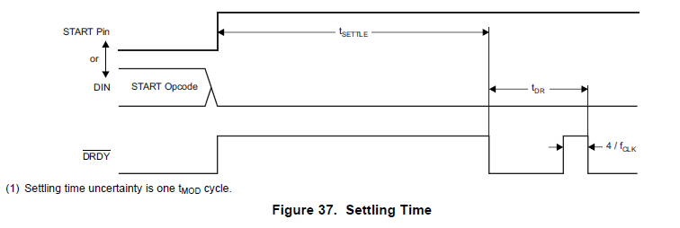
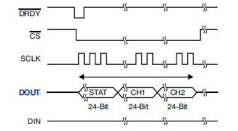
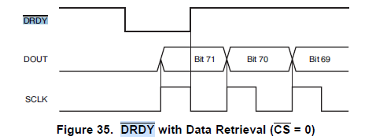

<h1 align="center"> khu_sensor </h1>

---  

khu_sensor is a module on a FPGA board that communicates with MPR121 and ADS1292 and sends sensing data to PC through RS232.  

---

## Contents
* [Introduction](#Introduction)
  - [Prerequisites](#Prerequisites)
  - [Block_Diagram](#Block_Diagram)
  - [How khu_sensor works](#Operation_Manual)
* [Modules](#Modules)
	- [khu_sensor_top](#khu_sensor_top)
  - [mpr121_controller](#mpr121_controller.v)
    + [i2c_master](#i2c_master)
	- [ads1292_controller](#ads1292_controller)
	  + [spi_master](#spi_master)
	- [sensor_core](#sensor_core)
	- [uart_controller](#uart_controller)
	  + [uart_rx](#uart_rx)
	  + [uart_tx](#uart_tx)
* [Reference](#Reference)
  - [mpr121_controller](#Reference_mpr121_controller)
  - [ads1292_controller](#Reference_ads1292_controller)
  - [sensor_core](#Reference_sensor_core)
  - [uart_controller](#Reference_uart_controller)

---

## Introduction

### Prerequisites

- Quartus II (Version 15.0)
- Altera DE2-115 Board (Cyclone IV E, EP4CE115F29C7)
- USB-Blaster
- RS232
- MPR121 (FreeScale) (Touch Sensor)
- ADS1292 (Texas Instrument) (ECG Sensor)
- Program which can be transmitted or received bytes by Serial port  
  // In this repository, we have Qt5 program(khu_sensor_ui) to control FPGA.   
  (or SerialPacketAnalysisSystem.exe that only operates on Windows)   
  **_Caution_** : **Qt5 Program is not fully implemented yet.**

### Block_Diagram


### Operation_Manual
For operating the module you must make sure that all wires and cables is connected with your FPGA board correctly.  
(you can modify Pin Assignments through Quartus.)  

First, Compare to our PIN Asssignment.  
  

|MPR121|||ADS1292|||
|----|----|----|----|----|----|
|VIN|5V||VCC|3.3V||
|GND|GND||DGND|GND||
|SCL|GPIO\[8\]|AD15|SCLK|GPIO\[26\]|AG22|
|SDA|GPIO\[9\]|AE15|DOUT(MISO)|GPIO\[27\]|AE24|
||||DIN(MOSI)|GPIO\[28\]|AH22|
||||DRDYN|GPIO\[29\]|AF26|
||||PWDN/RESETN|GPIO\[30\]|AE20|
||||START|GPIO\[31\]|AG23|
||||CSN|GPIO\[32\]|AF20|

#### Steps

1. send 'R'(8'h52) to the FPGA Board through Serial communication Program what you use.

2. receive [data](./Reference/khu_sensor/Packet_Definition.pptx) from FPGA  

  - **MPR121**
    

  - **MPR121 Data Process**  
    - MPR121 Data : {24'hBB0xxx} (xxx is ELE11~0 12 bits. MSB is ELE11 and LSB is ELE0)  

    - If data is processed in the bits form in your program, you do not need to convert them to analyze which Electrode is touched.  

    - However, If data is processed in the hex form in your program, you should convert them.  

      In our Qt5 Program
      ```cpp
      QBitArray mpr_bits((t_Data.count())*8);

      // Convert from QByteArray to QBitArray
      for(int i=0; i<t_Data.count(); i++) {
        for(int b=0; b<8; b++) {
          mpr_bits.setBit(mpr_bits.count()-1-(i*8+b), t_Data.at(i)&(1<<(7-b)) );
        }
      }
      /*
      mpr_bits.at(0) -> ELE0
      mpr_bits.at(1) -> ELE1
      mpr_bits.at(2) -> ELE2
      mpr_bits.at(3) -> ELE3
      mpr_bits.at(4) -> ELE4
      mpr_bits.at(5) -> ELE5
      mpr_bits.at(6) -> ELE6
      mpr_bits.at(7) -> ELE7
      mpr_bits.at(8) -> ELE8
      mpr_bits.at(9) -> ELE9
      mpr_bits.at(10) -> ELE10
      mpr_bits.at(11) -> ELE11
      */
      ```


  - **ADS1292**
    

  - **ADS1292 Data Process**  
    - ADS1292 Data : {32'hAAxxxxxx} (ADS1292 data is 3byte and MSB(sign) is left)  

    - ADS1292 Data need to calculate to convert signed integer.

      In our Qt5 Program
      ```cpp
      // t_Data is serial data which excluded header(0xBB)
      // MSB is index 0
      data1c = t_Data.at(0);
      data2c = t_Data.at(1);
      data3c = t_Data.at(2);

      if(t_Data.at(0) > 0x7F){
          data1c = ~data1c;
          data2c = ~data2c;
          data3c = ~data3c;

          data1l = ((unsigned int)(data1c<<8)<<8);
          data2l = (unsigned int)(data2c<<8);
          data3l = (unsigned int)(data3c);

          ADS_Data = data1l|data2l|data3l;
          ADS_Data += 1;
          ADS_Data = -ADS_Data;
        } else {
          data1l = ((unsigned int)(data1c<<8)<<8);
          data2l = (unsigned int)(data2c<<8);
          data3l = (unsigned int)(data3c);
          ADS_Data = data1l|data2l|data3l;
        }
        ```
        or
        ```
        ECG_Data = (data[0]<<16)|(data[1]<<8)|(data[2]);
        ```
    - If you want to obtain more clear ECG_data, you should implement Notch Filter(BSP)(Band Stop Filter), Low Pass Filter(LPF) and High Pass Filter(HPF). Data must be filtered in order of Notch Filter, LPF, HPF.  

    ||Notch Filter(BSP)|LPF|HPF|
    |----|----|----|----|
    |Sampling<br>Frequency(Hz)|250|250|250|
    |Cut-off/Middle<br>Frequency(Hz)|60|10|5|


3. If you want to stop the module, send 'S'(8'h53) to the FPGA Board through Serial communication Program what you use.

---

## Modules

### khu_sensor_top.v
khu_sensor_top is the top module of khu_sensor. The module assigns pins of fpga to wire and register. These pins are used to communicate with ADS1292(SPI), MPR121(I2C), PC(UART).  


#### Port Lists

###### SYSTEM I/0
* **input** CLOCK_50M // PIN_Y2
  - The DE2-115 board includes one oscillator that produces 50 MHz clock signal.
  - It is main clock of our modules.


* **input** KEY_0 // KEY[0] - PIN_M23
  - when it is pressed, voltage level is going to be Low(0)
  - It is main RSTN(Negative Reset) of our modules


* **output** [17:0] LEDR , [7:0]LEDG
  |LEDG|PIN|LEDR|PIN|
  |----|----|----|----|
  |LEDG[0]|E21|LEDR[0]|G19|
  |LEDG[1]|E22|LEDR[1]|F19|
  |LEDG[2]|E25|LEDR[2]|E19|
  |LEDG[3]|E24|LEDR[3]|F21|
  |LEDG[4]|H21|LEDR[4]|F18|
  |LEDG[5]|G20|LEDR[5]|E18|
  |LEDG[6]|G22|LEDR[6]|J19|
  |LEDG[7]|G21|LEDR[7]|H19|
  |||LEDR[8]|J17|
  |||LEDR[9]|G17|
  |||LEDR[10]|J15|
  |||LEDR[11]|H16|
  |||LEDR[12]|J16|
  |||LEDR[13]|H17|
  |||LEDR[14]|F15|
  |||LEDR[15]|G15|
  |||LEDR[16]|G16|
  |||LEDR[17]|H15|

  - LEDG[0] indicates initial setting of chips(MPR121, ADS1292) is done.
  - LEDG[1] indicates register setting of chips(MPR121, ADS1292) is done.
  - LEDG[2] indicates that sensor_core is running.
  - LEDR[11:0] indicates which MPR121 Electrodes are touched.
  - LEDR[16] indicates that error of MPR121 is occured.
  - LEDR[17] indicates that sensor_core is busy.


###### RS232
* **input** UART_RXD // PIN_G12
  - UART_RX of RS232 cable which receives data from PC


* **output** UART_TXD // PIN_G9
  - UART_TX of RS232 cable which transmits data to PC


###### DUT IO: MPR121 (I2C)
* **inout** MPR121_SCL // GPIO[8] - PIN_AD15
  - I2C Clock

* **inout** MPR121_SDA // GPIO[9] - PIN_AE15
  - I2C Data


###### DUT IO: ADS1292 (SPI)

* **output** ADS1292_SCLK // GPIO[26] - PIN_AG22
  - SPI Clock


* **output** ADS1292_MISO // GPIO[27] - PIN_AE24
  - SPI data from ADS1292 - Master input Slave output (read)


* **output** ADS1292_MOSI // GPIO[28] - PIN_AH22
  - SPI data to ADS1292 - Master Output Slave Input (write)


* **output** ADS1292_DRDY // GPIO[29] - PIN_AF26
  - This port indicates that new conversion data are ready when its value is Low(0).


* **output** ADS1292_RESET // GPIO[30] - PIN_AE20
  - Power-down or ADS1292 reset
  - active Low(0)


* **output** ADS1292_START // GPIO[31] - PIN_AG23
  - begin the data conversion


* **output** ADS1292_CSN // GPIO[32] - PIN_AF20
  - chip select to communicate
  - active low

_If you want to obtain more specific information, refer to [DE2-115](./Reference/DE2-115/DE2-115.pdf)_

---
### mpr121_controller.v
mpr121_controller is the module which controls MPR121 chip operation. It offers Read and Write register operation through I2C communication.
**this module must use in tandem with i2c_master.v**

#### Port Lists

##### input

* i_CLK
  - main clock


* i_RSTN       
   - reset the mpr121_controller module
   - active Low(0)


* [7:0] i_MPR121_REG_ADDR
  - MPR121 Register Address to write or read


* [7:0] i_MPR121_DATA_IN
  - data to write on MPR121 Register


* i_MPR121_WRITE_ENABLE
  - start writing operation


* i_MPR121_READ_ENABLE
  - start reading operation


##### output

* [7:0] o_MPR121_DATA_OUT
  - register data which is read from MPR121


* o_MPR121_INIT_SET
  - flag that soft reset of MPR121 is done.
  - The soft reset does not effect the i2c_master module, but make MPR121 same as POR(Power On Reset).


* o_MPR121_BUSY
  - busy flag that mpr121_controller is either on writing or reading operation


* o_MPR121_FAIL
  - flag that unexpected error is occurred during process         


##### inout
* I2C_SCL
  - I2C Clock


* I2C_SDA
  - I2C Data

#### Operation_Manual

##### Write Register
* put in 8bits Register Address you want to write to i_MPR121_REG_ADDR.

* put in 8bits Register Data to i_MPR121_DATA_IN.

* set i_MPR121_WRITE_ENABLE High(1).  
  _Caution : Do not set i_MPR121_WRITE_ENABLE and i_MPR121_READ_ENABLE High(1) at the same time._  

* The above three operations must be performed simultaneously or you should put in register address and data before setting i_MPR121_WRITE_ENABLE High(1).  

* **Make sure that set i_MPR121_WRITE_ENABLE Low(0) before the end of Writing operation.**

* o_MPR121_BUSY goes High(1) at next clock after setting i_MPR121_WRITE_ENABLE High(1).

* o_MPR121_BUSY goes Low(0) after finishing writing operation.

##### Read Register
* put in 8bits Register Address you want to read to i_MPR121_REG_ADDR.

* set i_MPR121_READ_ENABLE High(1).  
  _Caution : Do not set i_MPR121_WRITE_ENABLE and i_MPR121_READ_ENABLE High(1) at the same time._  

* The above two operations must be performed simultaneously or you should put in register address before setting i_MPR121_READ_ENABLE High(1).  

* **Make sure that set i_MPR121_READ_ENABLE Low(0) before the end of Reading operation.**

* o_MPR121_BUSY goes High(1) at next clock after setting i_MPR121_READ_ENABLE High(1).

* o_MPR121_BUSY goes Low(0) after finishing reading operation.

* After receiving 8bits register data from MPR121, the data is stored on o_MPR121_DATA_OUT.


_If you want to obtain more specific information and operation, refer to [Reference/mpr121_controller](#Reference_mpr121_controller)_

---

### ads1292_controller.v
ads1292_controller is the module which controls ADS1292 chip operation. It offers Read, Write register operation and Measuring Bio-potential through SPI communication.
**this module must use in tandem with spi_master.v**

#### Port Lists

##### input

* i_CLK
  - main clock


* i_RSTN       
   - reset the ads1292_controller module
   - active Low(0)


* [2:0] i_ADS1292_CONTROL
  - ads1292_controller's mode


* [7:0] i_ADS1292_COMMAND
  - command byte to control ADS1292
  - used only in SYSCMD mode


* [7:0] i_ADS1292_REG_ADDR
  - ADS1292 Register Address to write or read


* [7:0] i_ADS1292_DATA_IN
  - data to write on ADS1292 Register


* i_SPI_MISO
  - SPI data from ADS1292 - Master input Slave output (read)


* i_ADS1292_DRDY
  - falling edge when conversion data is ready
  - flag that indicates module should start to read 72bits data


##### output

* [71:0] o_ADS1292_DATA_OUT   
  - In RDATAC mode, 72bits Bio-potential data
  - In RREG mode, o_ADS1292_DATA_OUT[7:0] is the register data

* o_ADS1292_INIT_SET   
  - flag that initial reset of ADS1292 is done.
  - The reset does not effect the spi_master module, but make ADS1292 initial state and   being on SDATAC mode.

* o_ADS1292_DATA_READY  
  -In RDATAC mode,  flag that 72 bits data was all read and be ready to use.


* o_ADS1292_BUSY
  - busy flag that ads1292_controller is either on writing or reading operation


* o_SPI_CLK   
  - SPI Clock        


* o_SPI_MOSI
  - SPI data to ADS - Master Output Slave Input (write)


* o_ADS1292_RESET   
  - Power-down or ADS1292 reset
  - active Low(0)


* o_ADS1292_START  
  - begin the data conversion


* o_SPI_CSN   
  - chip select to communicate
  - active low

#### Operation_Manual

##### Write SPI Command
* put in 8bits Command Byte you want to control to i_ADS1292_COMMAND.

* set i_ADS1292_CONTROL to 3'b001.   

* These operations must be performed at the same time or you should put in Command Byte before setting i_ADS1292_CONTROL to 3'b001.  

* **Make sure that put in 3'b111 to i_ADS1292_CONTROL before the end of Writing Command operation.**

* o_ADS1292_BUSY goes High(1) at next two clocks after setting i_ADS1292_CONTROL to 3'b010.

* o_ADS1292_BUSY goes Low(0) after finishing writing command operation.

##### Write Register
* put in 8bits Register Address you want to write to i_ADS1292_REG_ADDR.

* put in 8bits Register Data to i_ADS1292_DATA_IN.   

* set i_ADS1292_CONTROL to 3'b010.

* These operations must be performed at the same time or you should put in Register Address and Register Data before setting i_ADS1292_CONTROL to 3'b010.  

* **Make sure that put in 3'b111 to i_ADS1292_CONTROL  before the end of Writing Register operation.**

* o_ADS1292_BUSY goes High(1) at next two clocks after setting i_ADS1292_CONTROL to 3'b011.

* o_ADS1292_BUSY goes Low(0) after finishing writing register operation.

##### Read Register
* put in 8bits Register Address you want to read to i_ADS1292_REG_ADDR.

* set i_ADS1292_CONTROL to 3'b011.

* These operations must be performed at the same time or you should put in Register Address e before setting i_ADS1292_CONTROL to 3'b011.  

* **Make sure that put in 3'b111 to i_ADS1292_CONTROL  before the end of Reading Register operation.**

* o_ADS1292_BUSY goes High(1) at next two clocks after setting i_ADS1292_CONTROL to 3'b011.

* o_ADS1292_BUSY goes Low(0) after finishing writing register operation.

* After receiving 8bits register data from ADS1292, the data is stored on o_ADS1292_DATA_OUT[7:0].

##### Read Bio-potential Data

* set i_ADS1292_CONTROL to 3'b100.

* o_ADS1292_BUSY goes High(1) at next two clocks after setting i_ADS1292_CONTROL to 3'b100.

* After receiving 72bits conversion data from ADS1292, o_ADS1292_DATA_READY is pulled High(1) and the data is stored on o_ADS1292_DATA_OUT.
  _Caution : data is only worthy when o_ADS1292_DATA_OUT is High(1)_

* o_ADS1292_DATA_READY goes Low(0) when two clocks passed after being pulled up o_ADS1292_DATA_READY to High(1).

##### Stop Bio-potential Data

* set i_ADS1292_CONTROL to 3'b101.

* o_ADS1292_BUSY goes Low(0) after finishing Reading Bio-potential Data. (RDATAC mode only can be finished by setting SDATAC mode)

* **Recommendation : You should put in 3'b111 to i_ADS1292_CONTROL before the end of Writing SDATAC Command byte operation.**  
  **Even if you do not set i_ADS1292_CONTROL to 3'b111, ads1292_controller will not go other Mode**  


_If you want to obtain more specific information and operation, refer to [Reference/ads1292_controller](#Reference_ads1292_controller)_

---

### sensor_core.v
sensor core is the pivot module on this project. It controls mpr121_controller, ads1292_controller, uart_controller comprehensively.
It process Command which received from UART_RX of uart_controller, and make that mpr121_controller and ads1292_controller operates specific task.
Furthermore, when sensor_core is perceived a flag that data is ready to be sent, It impose uart_controller to transmit data which is from mpr121_controller and ads1292_controller to PC.
**this module cannot use independent**  
**you must use with all Source File(mpr121_controller.v, ads1292_controller.v, uart_controller.v ...)**

#### Port Lists


// System connection with MPR121 data


// ADS1292
input [71:0] i_ADS1292_DATA_OUT, // read data from ADS1292
output reg [2:0] o_ADS1292_CONTROL, // ADS1292 Control
output reg [7:0] o_ADS1292_COMMAND, // ADS1292 SPI command
output reg [7:0] o_ADS1292_REG_ADDR, // ADS1292 register address
output reg [7:0] o_ADS1292_DATA_IN, // data to write in ADS1292 register
input i_ADS1292_INIT_SET, // signal that start to read data in RDATAC mode
input i_ADS1292_DATA_READY, // In Read data continue mode,  flag that 72 bits data is ready
input i_ADS1292_BUSY,

// System I/O
output reg o_CHIP_SET,
output reg o_RUN_SET,
output reg o_CORE_BUSY,
input wire i_CLK,
input wire i_RST
##### uart_controller

* **output** [31:0] o_UART_DATA_TX
  - tx data which send to PC


* **output** o_UART_DATA_TX_VALID
  - tx data is valid
  - A flag which means that It is okay to send o_UART_DATA_TX via UART_TXD


* **input** i_UART_DATA_TX_READY
  - tx is Ready for next byte
  - A flag which means that uart_controller finish TX tasks and is possible to send other byte.


* **input** [15:0] i_UART_DATA_RX  
  - rx data which receive from PC


* **input** i_UART_DATA_RX_VALID
  - rx data is valid
  - A flag which means that Rx data is fully received and can be used
  // MPR121
  input [7:0] i_MPR121_DATA_OUT,  // received data from MPR121 (read data)
  output reg [7:0] o_MPR121_REG_ADDR,   // transmitted register address to MPR121 (write data)
  output reg [7:0] o_MPR121_DATA_IN,  // transmitted data to MPR121 (write data)
  output reg o_MPR121_WRITE_ENABLE,
  output reg o_MPR121_READ_ENABLE,
  input i_MPR121_INIT_SET,
  input i_MPR121_BUSY,
  input i_MPR121_FAIL,
  output reg [11:0] o_MPR121_TOUCH_STATUS,
  output reg o_MPR121_ERROR,

##### MPR121     
* **input** [7:0] i_MPR121_DATA_OUT
  - received register data from MPR121 (read data)
  * alternately recieve touch status from sensor **0~7** and **8~11**     


* **output** [7:0] o_MPR121_REG_ADDR
  - transmitted register address of MPR121 to write or read (write or read data)


* **output** [7:0] o_MPR121_DATA_IN[7:0] : data to write on specific MPR address
  - transmitted register data to MPR121 (write data)


* **output** o_MPR121_WRITE_ENABLE  
    - start/enable writing operation           


* **output** o_MPR121_READ_ENABLE      
    - start/enable reading operation       
    * o_MPR121_INIT_SET


    * o_MPR121_BUSY
      - busy flag that mpr121_controller is either on writing or reading operation


    * o_MPR121_FAIL
      - flag that unexpected error is occurred during process         


* **input** i_MPR121_INIT_SET
  - A flag that indicates MPR121 initial setting is done


* **input** i_MPR121_BUSY
  - A flag that indicates MPR121 is writing or reading


* **input** i_MPR121_FAIL     
    - A flag that indicates MPR121 error is occurred during writing or reading


* **output** o_MPR121_TOUCH_STATUS
  - o_MPR121_TOUCH_STATUS[11:8] : MPR121 ELE11 ~ 8 status       
  - o_MPR121_TOUCH_STATUS[7:0] : MPR121 ELE7 ~ 0 status
  - It is connected with LEDR[11:0] and the lights on same index with ELE node when it is touched.  

* **output** o_MPR121_ERROR
  - It is connected with LEDR[16] and its light on when i_MPR121_FAIL is pulled high.


##### ADS1292      
* i_ADS1292_DATA_OUT       
  * i_ADS1292_DATA_OUT[71:48] : ADS status data      
  * i_ADS1292_DATA_OUT[47:24] ; ADS CH1 data      
  * i_ADS1292_DATA_OUT[23:0] : ADS CH2 data          
* i_ADS1292_INIT_SET       
  * 1'b1 : initiation code successfully passed to ADS       
* i_ADS1292_DATA_READY      
  * 1'b1 : **i_ADS1292_DATA_OUT[71:0]** are ready to be passed by ADS       
* i_ADS1292_BUSY       
  * 1'b1 : ADS either on WRITE or READ state      
* i_ADS1292_FAIL     
  * 1'b1 : unexpected error occured during process      

##### System I/O      
* i_CLK : 25MHz clock    
* i_RST       
   * 1'b1 : reset all process      


### Output       
##### UART Controller        

##### MPR121     


##### ADS1292      
* o_ADS1292_CONTROL [2:0]             
  * 3'b001 : ADS on system command  mode      
  * 3'b010 : ADS on write register mode      
  * 3'b011 : ADS on read register mode      
  * 3'b100 : ADS on read data continuously mode          
  * 3'b101 : ADS on stop data continuously mode       
  * 3'b111 : ADS on send dummy mode        
* o_ADS1292_COMMAND [7:0] : send user defined command according to **o_ADS1292_CONTROL[2:0]**      
* o_ADS1292_REG_ADDR [7:0] : specific register address of ADS to write or read       
* o_ADS1292_DATA_IN[ [7:0] : data to write on specific ADS address     

##### System I/O      
* o_CHIP_SET       
  * 1'b1 :  both MPR and ADS chip set done       
* o_RUN_SET       
  * 1'b1 : both MPR and ADS run set done          
* o_CORE_BUSY        
  * 1'b1 : both MPR and ADS on reading data state


#### Operation_Manual

##### Write SPI Command
* put in 8bits Command Byte you want to control to i_ADS1292_COMMAND.

* set i_ADS1292_CONTROL to 3'b001.   

* These operations must be performed at the same time or you should put in Command Byte before setting i_ADS1292_CONTROL to 3'b001.  

* **Make sure that put in 3'b111 to i_ADS1292_CONTROL before the end of Writing Command operation.**

* o_ADS1292_BUSY goes High(1) at next two clocks after setting i_ADS1292_CONTROL to 3'b010.

* o_ADS1292_BUSY goes Low(0) after finishing writing command operation.

##### Write Register
* put in 8bits Register Address you want to write to i_ADS1292_REG_ADDR.

* put in 8bits Register Data to i_ADS1292_DATA_IN.   

* set i_ADS1292_CONTROL to 3'b010.

* These operations must be performed at the same time or you should put in Register Address and Register Data before setting i_ADS1292_CONTROL to 3'b010.  

* **Make sure that put in 3'b111 to i_ADS1292_CONTROL  before the end of Writing Register operation.**

* o_ADS1292_BUSY goes High(1) at next two clocks after setting i_ADS1292_CONTROL to 3'b011.

* o_ADS1292_BUSY goes Low(0) after finishing writing register operation.

##### Read Register
* put in 8bits Register Address you want to read to i_ADS1292_REG_ADDR.

* set i_ADS1292_CONTROL to 3'b011.

* These operations must be performed at the same time or you should put in Register Address e before setting i_ADS1292_CONTROL to 3'b011.  

* **Make sure that put in 3'b111 to i_ADS1292_CONTROL  before the end of Reading Register operation.**

* o_ADS1292_BUSY goes High(1) at next two clocks after setting i_ADS1292_CONTROL to 3'b011.

* o_ADS1292_BUSY goes Low(0) after finishing writing register operation.

* After receiving 8bits register data from ADS1292, the data is stored on o_ADS1292_DATA_OUT[7:0].

##### Read Bio-potential Data

* set i_ADS1292_CONTROL to 3'b100.

* o_ADS1292_BUSY goes High(1) at next two clocks after setting i_ADS1292_CONTROL to 3'b100.

* After receiving 72bits conversion data from ADS1292, o_ADS1292_DATA_READY is pulled High(1) and the data is stored on o_ADS1292_DATA_OUT.
  _Caution : data is only worthy when o_ADS1292_DATA_OUT is High(1)_

* o_ADS1292_DATA_READY goes Low(0) when two clocks passed after being pulled up o_ADS1292_DATA_READY to High(1).

##### Stop Bio-potential Data

* set i_ADS1292_CONTROL to 3'b101.

* o_ADS1292_BUSY goes Low(0) after finishing Reading Bio-potential Data. (RDATAC mode only can be finished by setting SDATAC mode)

* **Recommendation : You should put in 3'b111 to i_ADS1292_CONTROL before the end of Writing SDATAC Command byte operation.**  
  **Even if you do not set i_ADS1292_CONTROL to 3'b111, ads1292_controller will not go other Mode**  


_If you want to obtain more specific information and operation, refer to [Reference/ads1292_controller](#Reference_ads1292_controller)_

---

### uart_controller.v
sensor core is the pivot module on this project. It controls mpr121_controller, ads1292_controller, uart_controller comprehensively.
It process Command which received from UART_RX of uart_controller, and make that mpr121_controller and ads1292_controller operates specific task.
Furthermore, when sensor_core is perceived a flag that data is ready to be sent, It impose uart_controller to transmit data which is from mpr121_controller and ads1292_controller to PC.
**this module cannot use independent**  
**you must use with all Source File(mpr121_controller.v, ads1292_controller.v, uart_controller.v ...)**

## Reference

### Reference_mpr121_controller

**[MPR121_DataSheet](./Reference/MPR121/MPR121.pdf)**


####MPR121 Register Map  

|Register Name|Address|Value|Description|  
|----|----|----|----|
|ELE0-ELE7 Touch Status|8'h00||read only|
|ELE8-ELE11 Touch Status|8'h01||read only|
|Maximum Half Delta Rising(MHDR)|8'h2B|8'h01|d|
|Noise Half Delta Amount Rising(NHDAR)|8'h2C|8'h01|d|
|Noise Count Limit Rising(NCLR)|8'h2D|8'h0E|d|
|Filter Delay Count Limit Rising(FDLR)|8'h2E|8'h00|d|
|Maximum Half Delta Falling(MHDF)|8'h2F|8'h01|d|
|Noise Half Delta Amount Falling(NHDAF)|8'h30|8'h05|d|
|Noise Count Limit Falling(NCLF)|8'h31|8'h01||
|Filter Delay Count Limit Falling(FDLF)|8'h32|8'h00||
|Noise Half Delta Amount Touched(NHDAT)|8'h33|8'h00||
|Noise Count Limit Touched(NCLT)|8'h34|8'h00||
|Filter Delay Count Limit Touched(FDLT)|8'h35|8'h00||
|Debounce Touch & Release|8'h5B|8'h00||
|Filter/Global CDC Configuration|8'h5C|8'h10||
|Filter/Global CDT Configuration|8'h5D|8'h20||
|Electrode Configuration|8'h5E|8'h8F||
|Soft Reset|8'h80|8'h63||
|AUTO-CONFIG Control 0|8'h7B|8'h0B||
|AUTO-CONFIG Control 1|8'h7C|||
|AUTO-CONFIG Up-Side Limit|8'h7D|8'h9C||
|AUTO-CONFIG Low-Side Limit|8'h7E|8'h65||
|AUTO-CONFIG Target Level|8'h7F|8'h8C||


**not busy**   
SDA, SCL all high   
**busy**   
Start : 'Start' is change point of state when SDA changes from high to low.     
Stop : 'Stop' is change point of state when SDA changes from high to low.

## i2c_master
```verilog

Read
    __    ___ ___ ___ ___ ___ ___ ___         ___ ___ ___ ___ ___ ___ ___ ___     ___ ___ ___ ___ ___ ___ ___ ___        __
sda   \__/_6_X_5_X_4_X_3_X_2_X_1_X_0_\_R___A_/_7_X_6_X_5_X_4_X_3_X_2_X_1_X_0_\_A_/_7_X_6_X_5_X_4_X_3_X_2_X_1_X_0_\_A____/
    ____   _   _   _   _   _   _   _   _   _   _   _   _   _   _   _   _   _   _   _   _   _   _   _   _   _   _   _   ____
scl  ST \_/ \_/ \_/ \_/ \_/ \_/ \_/ \_/ \_/ \_/ \_/ \_/ \_/ \_/ \_/ \_/ \_/ \_/ \_/ \_/ \_/ \_/ \_/ \_/ \_/ \_/ \_/ \_/ SP

Write
    __    ___ ___ ___ ___ ___ ___ ___ ___     ___ ___ ___ ___ ___ ___ ___ ___     ___ ___ ___ ___ ___ ___ ___ ___ ___    __
sda   \__/_6_X_5_X_4_X_3_X_2_X_1_X_0_/ W \_A_/_7_X_6_X_5_X_4_X_3_X_2_X_1_X_0_\_A_/_7_X_6_X_5_X_4_X_3_X_2_X_1_X_0_/ N \__/
    ____   _   _   _   _   _   _   _   _   _   _   _   _   _   _   _   _   _   _   _   _   _   _   _   _   _   _   _   ____
scl  ST \_/ \_/ \_/ \_/ \_/ \_/ \_/ \_/ \_/ \_/ \_/ \_/ \_/ \_/ \_/ \_/ \_/ \_/ \_/ \_/ \_/ \_/ \_/ \_/ \_/ \_/ \_/ \_/ SP

```

### Input
* cmd_address[6:0]
  * MPR121 Slave Address
  * set to 7'b1011_010(0x5A) - ADDR pin connect to Ground
* cmd_start
  * 1'b1 : i2c start
* cmd_read
  * 1'b1 : i2c read (send 0)
* cmd_write
  * 1'b1 : i2c write (send 1)
* cmd_write_multiple
  * 1'b1 : i2c write multiple (until data_in_last)
* cmd_stop
  * 1'b1 : i2c stop
* cmd_valid
  * 1'b1 : command valid
* data_in[7:0]
  * 1 byte data to MPR121 - i2c(master input)
* data_in_valid
  * valid of input data byte
* data_in_last
  * flag of last data to write (using for write multiple)
* data_out_ready
  * ready flag which indicate status that Slave finish to read 1 byte data
* prescale[15:0]      
  * set to 16'd125    
    * set prescale to 1/4 of the minimum clock period in units of input i_CLK cycles
    * prescale = Fclk / (FI2Cclk * 4) = 50M / (100k * 4) = 125
* stop_on_idle
  * set to 1'b1 - automatically issue stop when command input is not valid


### Output
* cmd_ready
  * ready to operate command
* data_in_ready
  * ready flag which indicate status that Master can receive data byte to write when Master finish to write previous data sent
* data_out[7:0]
  * 1 byte data from MPR121 - i2c(master output)
* data_out_valid
  * valid of output data byte
* data_out_last
  * flag of last data to read (In general, we don't know how much long data is)
* missed_ack
  * check nack


### Reference_ads1292_controller

**[ADS1292_DataSheet](./Reference/ADS1292/ADS1292.pdf)**

####ADS1292 Mode

**ADS1292 Control Cases: (User defined) (exclude other mode in [data sheet](./Reference/ADS1292/ADS1292.pdf))**
|Mode|i_ADS1292_CONTROL|Description|  
|----|----|----|
|IDLE|3'b000|Idle state before Reset the Chip(POR)|
|System control|3'b001|8'h02|Write Command<br>use i_ADS1292_COMMAND, do not use i_ADS1292_REG_ADDR|
|Write Register|3'b010|8'hA0 |Write data on Register<br>use i_ADS1292_REG_ADDR, do not use i_ADS1292_COMMAND|
|Read Register|3'b011|8'h10 |Read data from Register<br>use i_ADS1292_REG_ADDR, do not use i_ADS1292_COMMAND|
|Read Data Continue|3'b100|8'h02 |Read Bio-potential Data<br>only worked by control bit|
|Stop Read Data Continue|3'b101|8'h00 |Stop Reading Bio-potential Data<br>only worked if controller is rdatac_mode, and worked by control bits|
|Dummy|3'b111|8'h63 |do nothing|

_**ADS1292 offers Multi-byte Write or Read, but we only write or read only one register**_

####ADS1292 Command

**ADS1292 COMMAND Cases: (exclude other mode in [data sheet](./Reference/ADS1292/ADS1292.pdf))**
|Command|i_ADS1292_COMMAND|Description|  
|----|----|----|
|RESET|8'h02|This command resets the digital filter cycle and returns all register settings to the default values|
|START|3'b001|8'h02|This opcode starts data conversions|
|STOP|3'b010|8'hA0 |This opcode stops data conversions|
|RDATAC|3'b011|8'h10 |This opcode enables the output of conversion data on each DRDY_N without the need to issue subsequent read
data opcodes.|
|SDATAC|3'b100|8'h02 |This opcode cancels the Read Data Continuous mode|

_**If you put in STATR, STOP, RESET Commands to i_ADS1292_COMMAND, These Commands are controlled by pins, not sending command byte**_

####ADS1292 Register Map  

|Register Name|Address|Value|Description|  
|----|----|----|----|
|ID|8'h00||read only|
|CONFIG1|8'h01|8'h02||
|CONFIG2|8'h02|8'hA0 ||
|LOFF|8'h03|8'h10 ||
|CH1SET|8'h04|8'h02 ||
|CH2SET|8'h05|8'h00 ||
|RLD_SENS|8'h06|8'h63 ||
|LOFF_SENS|8'h07|8'h0F ||
|LOFF_STAT|8'h08|8'h00 ||
|RESP1|8'h09|8'h02 ||
|RESP2|8'h0A|8'h03 ||
|GPIO|8'h0B|8'h00||

[1. How ADS works](#how-ads-works)

[2. How ADS stops](#how-ads-stops)

[3. How to run MPR ](#how-mpr-works)

[4. Module Detail](#module-detail)

- - -

# How ADS works


 Through wire **UART_RXD** from PC,  8 kind of controls are available.(list below)

|| Command | byte |
|---| ---|---|
|1|UART_SG_MPR_SEND_DATA| 8'h4D |
|2|UART_SG_MPR_READ_REG| 8'h6D |
|3|UART_SG_ADS_SEND_DATA| 8'h41 |
|4|UART_SG_ADS_READ_REG| 8'h61 |
|5|UART_SG_RUN| 8'h52 |
|6|UART_SG_STOP| 8'h53 |
|7|UART_SG_ADS_FINISH| 8'h46 |
|8|UART_SG_MPR_FINISH| 8'h66 |

But just by sending 8'h52 which is **RUN** , precedure of setting register and exporting output begins automatically. So this README.md will only treat **Run** mode

Getting 8'h52 through [uart_rx.v](#uart_rx.v), **w_uart_data_ra_valid** becomes 1'b1 for a cycle and satifies condition
   * **w_uart_data_ra_valid : let FPGA know just got finished receiving data through uart completely**

```verilog

//uart_controller.v

if(w_uart_data_rx_valid) begin
              if(w_uart_data_rx == UART_SG_RUN) begin
                o_UART_DATA_RX[15:8] <= w_uart_data_rx;
                o_UART_DATA_RX_VALID <= 1'b1;
                r_pstate <= ST_IDLE;
              end

```

**w_uart_data_rx, w_uart_data_rx_valid** from uart_controller.v will initiate ***sensor core***   
Inside sensor core, 3 parts(**uart, sensor core, ads1292**) will have it's own sequential logic

> uart SL: as a result of ***ST_UART_RX***, reg **r_run_mode** <=1'b1 and reg **r_ads_read_start** <=1'b1.   
> sensor core SL: handle [chip set](#chip-set) and [run set](#run-set)   
> ads1292 SL :  details of **chip set** and **run set** are executed here

First, initiate [chip set](#chip-set) process. when chip set success, FPGA gets **r_ads_chip_set_done<=1'h1** (at sensor_core)     
This will make **o_CHIP_SET<=1b'1**(meaning chip setting is done) and allows to move sensor core state to ***ST_CORE_STANDBY***.   
```verilog
ST_CORE_STANDBY:
  begin
    if(r_run_mode) begin
      if(!r_ads_run_set_done) r_ads_run_set <= 1'b1;
      else r_ads_is_reading <= 1'b1;
    end
  end
```

Second, as **r_ads_is_reading** from 'sensor_core SL' becomes **1'b1**, ads1292 SL start [run_set](#run-set) process.     
When **Run-set** is done, sensor core will recieve **i_ADS1292_DATA_READY** high(1'b1) and **i_ADS1292_DATA_OUT[71:0] and this will make **o_CORE_BUSY** high(1)   

Third, at state ***ST_ADS_RDATAC_INIT, ST_ADS_RDATAC_DATA_PROCESS***, due to condition satisfaction, assign **r_ads_data_convert[31:0],r_ads_data_send_ready**    
   * **r_ads_data_convert[31:0] ** : {8b'0, i_ADS1292_DATA_OUT[23:16], i_ADS1292_DATA_OUT[15:8], i_ADS1292_DATA_OUT[7:0]}    
   * **r_ads_data_send_ready** : finished assign neccessary data (In our case, CH2 data which is 24 bits),   

Fourth, at UART SL state ***ST_UART_STANDBY*** , export data **o_UART_DATA_TX[39:0], o_UART_DATA_TX_VALID** to **uart_controller.v**
   * **o_UART_DATA_TX_VALID** : signal that inititate uart_tx    
   * **o_UART_DATA_TX[39:0] ** : {UART_SG_ADS_SEND_DATA, r_ads_data_convert}    
      * UART_SG_ADS_SEND_DATA : in our code it is 8'h41, it will just work as header for PC

Fifth, as **o_UART_DATA_TX_VALID** goes high(1) send data through [uart_tx](#uart-tx.v)

Then from now on, process after **Run set** will repeated and keep export 72bits data to sensor core!!.     
And It is technically everything you need to know to Run ADS!!     

- - -

# How ADS stops

The way ADS stop is very similiar to the way ADS works.  

From PC, send 8bit data  8'h53 to give stop signal to FPGA     
Of course, stop signal is supposed to import while ADS is running( **i_CORE_BUSY** on high(1) state)

This stop signal will effect all three SL inside  **sensor_core.v**, and most important SL is ADS SL!!     
   *  **uart** : assign all **r_run_mode, r_ads_read_start** low(0)    
   *  **sensor core** : assign **r_ads_run_set, r_ads_is_reading** low(0)     

As I mentioned, ADS is currently on running mode, so state of ADS SL should be either **ST_ADS_RDATAC_INIT** or **ST_ADS_RDATAC_DATA_PROCESS**    
at state **ST_ADS_RDATAC_INIT**, because **r_ads_run_set** is low(0) next state will be ***ST_ADS_STOP***

Then, **o_RUN_SDATAC** control command goes to ***ads1292_controller.v***     
Again, ADS is currently on running mode, state at ADS1292_controller.v should be either **ST_RDATAC_WAIT_DRDY, ~ ~ ~**.

```verilog

ST_RDATAC_WAIT_DRDY:
begin
	o_ADS1292_RDATAC_READY <= 1'b0; // wait 2 clock to turn off since sensor_core's clock is 25MHz-YHM
	if(i_ADS1292_DRDY) begin
		if(r_lstate == ST_RDATAC_INIT) r_pstate <= ST_RDATAC_WAIT_SETTILING_TIME;
		else r_pstate <= ST_RDATAC_WAIT_DRDY_PULSE;
	end else begin
		if (r_sdatac_mode) r_pstate <= ST_SDATAC_INIT;
		else r_pstate <= ST_RDATAC_WAIT_DRDY;
	end
end
```


After this, ads1292_controller.v will send command using MOSI communication.    
>    while on move to ***ST_SYS_SENDCMD*** for MOSI, you'll easily see **if(i_ADS1292_DRDY) r_pstate <= ST_RDATAC_WAIT_DRDY** code    
>    this code is added to consider keep out zone of DRDY pulse.    

When command is sent, to tell FPGA about the status, export **o_ADS1292_START, o_ADS1292_RDATAC_READY,o_ADS1929_BUSY, o_SPI_CSN**    
  * o_ADS1292_START: <- 1'b0 turned off the device    
  * o_ADS1292_READY: <- 1'b0 device not ready to work     
  * o_ADS1292_BUSY: <- 1'b0 device ready to do anything    
  * o_SPI_CSN: <- 1'b1  In condition Chip Select high device can not get any command.    
    * **Before taking CSN high always wait 4 * t_clk(512kHz) == t_MOD or more cycles.

That's technically all for stopping ADS. sensor core stays idle until new command issued from PC   

# How MPR Works

**pretty much same with ADS procedures, so skipped **


- - -
- - -

## Chip Set

as a result of ***ST_CORE_START*** from sensor_core.v and code below, chip set begins   

```verilog

always @ ( posedge i_CLK, posedge i_RST ) begin
		if(i_RST) o_CHIP_SET <= 1'b0;
		else o_CHIP_SET <= r_mpr_chip_set_done & r_ads_chip_set_done;
	end

```

Default setting of registers are below (check detail description at ADS1292 datasheet)

| Address | Name | Data|
|---|---|---|


#### Procedure

1. At state ***ST_ADS_SETTING***, assign **r_asd_first_param, r_ads_second_param**     
   * **r_ads_first_param** : 8 bits representing **address** of register to set    
   * **r_ads_second_param** : 8 bits representing **data** to set at designated register      

2. outputs of sensor core(**o_ADS1292_CONTROL, o_ADS1292_REG_ADDR, o_ADS1292_DATA_IN**) goes to ads1292_controller	 
   * **o_ADS1292_COMMAND** : default value for this reg is 1'b0, but later when using command input for wakeup and standby, no need for this


3. Inside the [ads1292_controller](#ads1929_controller.v), send 3 bytes data using SPI [MOSI](#mosi) comunication    
   * First Byte: 010r rrrr    
     * 010: meaning **write**    
     * r rrrr: address of register    
   * Seconde Byte: 0000_0000
     * meaning how many continuous register we will set start from r rrrr (available: 0~9)    
     (we will write data to register one by one)     
   * Third Byte: 8 bit default data users wanna set


4. After MOSI SPI communication, wait 4/(t_clk==512kHz) = 4/512k clocks for CSN to go high.
   * we are using 50M clock for FPGA, so at least wait (4/512k)/(1/50M)=390.625 cycles for CSN


5. Setting data is done and export **o_ADS1292_Busy, o_SPI_CSN** to let FPGA know it's finished.
   * **o_ADS1292_Busy** : whether ADS is working on something(YES=>1'b1, NO=>1'b0)    
   * **o_SPI_CSN** : whether we are working on this specfic chip(YES=>1'b0, NO=>1'b1)    


6. Sensor_core.v will get **i_ADS1929_Busy** 1'b0 and start chip setting with next register.      

```verilog
ST_ADS_WREG_CONFIRM:
begin
	o_ADS1292_CONTROL <= ADS_CB_IDLE;
	if(i_ADS1292_BUSY) r_ads_pstate <= ST_ADS_WREG_CONFIRM;
	else begin
	~~if (r_ads_lstate == ST_ADS_SETTING)~~ r_ads_pstate <= ST_ADS_SETTING;
	end
end
```

7. when all registers setting are done let FPGA know it by making **r_ads_chip_set_done** high(1'b1)


---

## Run set

As **r_ads_is_reading** becomes 1'b1 at ***sensor_core.v*** Run set Initiates

There are two methods of getting data, using RDATA and RDATAC   
  * RDATA: read data once when requested    
  * RDATAC: read data continuously once requested

Our source is using **RDATAC** so far.  ~~might later fixed~~

Also, we need to start ads1292 before running, this can be done by either command or pin
  * Command: send START command and keep START pin low(0) until the STOP command is issued
  * Pin: set Start pin High(1)

Our source are using Pin way.

#### Procedure

1. At ads1292 Sequential Logic state ***ST_ADS_RUN***, export **o_ADS1292_CONTROL<=ADS_CB_RDATAC** control signal.

2. Control signal goes into ***ads1292_controller.v*** and begin **r_rdatac_mode** .

3. At state ***ST_SYSCMD_INIT***, begin [MOSI](#mosi) communication with **r_spi_data_in, r_spi_data_in_valid**    
  * **r_spi_data_in** : FPGA will shoot 8'h10( Byte representing RDATAC)
  * **r_spi_data_in_valid** : Triggering clock for SPI communication.

4. At state **ST_SYSCMD_SEND_CMD**, wait till MOSI SPI communication ends.	   
  * **i_ADS1292_DRDY** : FPGA is trying to send data, so stays low(0)  

```verilog
ST_SYSCMD_SEND_CMD:
	begin
	if(r_lstate != ST_SDATAC_INIT) begin
		if(!w_spi_data_in_ready) begin
			r_spi_data_in_valid <= 1'b0;
			r_pstate <= ST_SYSCMD_SEND_CMD;
		end else begin
			if(r_lstate != ST_RDATAC_INIT) r_lstate <= ST_SYSCMD_SEND_CMD;
			r_pstate <= ST_SPI_SELECT;
		end
	end else begin
		if(i_ADS1292_DRDY) r_pstate <= ST_RDATAC_WAIT_DRDY;		//DRDY is mapped to pin!!! from ADS
		else begin
			if(!w_spi_data_in_ready) begin
				r_spi_data_in_valid <= 1'b0;
				r_pstate <= ST_SYSCMD_SEND_CMD;
			end else r_pstate <= ST_SPI_SELECT;
		end
	end
end
```

5. Next, at ***ST_RDATAC_WAIT_DRDY*** state, because  current **r_lstate** is ***ST_RDATAC_INIT***, moves to ***ST_RDATAC_WAIT_SETTLING_TIME***


<p align="center">
  
</p>


5-1. The time needed for converter to output fully settled data when **START** pin goes high is called **Settling time**  (need  once when OPCODE changes)
  * In our case, we setted **LOFF STAT** 8'b0F and **CONFIG1[2:0]** 3'b010   
     * CONFIG[2:0] == 3'b010 : settling time will be **1028 x t_mod**  with one t_mod uncertainty
     * LOFF STAT[7]=CLK_DIV == 0 : t_mod = 4 x t_clk, default f_clk is 512 kHz -> f_mod = f_clk / 4

5-2. So, according to **5-1** and we are using 50M kHz for general, cycle needed can be calculated      
  * {(1028+2) x t_mod} / (1/ CLK_50M) = 1030 x ( 4 x (1 / 512 * 1000) ) * 50 * 1,000,000 = 402,338.6    
    * +2: Considering uncertainty

```verilog

ST_RDATAC_WAIT_SETTLING_TIME:
begin
	if(r_clk_counter > 32'd402318) begin //402318
		r_clk_counter <= 32'b0;
		r_pstate <= ST_RDATAC_WAIT_SETTLED_DATA;
	end else begin
		r_clk_counter <= r_clk_counter + 1'b1;
		r_pstate <= ST_RDATAC_WAIT_SETTILING_TIME;
	end
end

```


6. After settling is done, wait for 3 t_DR for setted data to be done(at ***ST_RDATAC_WAIT_SETTLED_DATA*** state.)    
  *  Reference - ADS1292 - ADS1292.pdf p.31 Settling time      
      > Note that when START is held high and there is a step change in the input signal, it takes 3 t_DR for the filter to settle to the new value.     
      > Settled data are available on the fourth DRDY pulse.


7. Now, ads1292 is ready to export **DOUT**    
     * **DOUT**: The data output pin (DOUT) is used with SCLK to read conversion and register data from ADS1292
     * 24 status bits+ 24bits x 2 channels= 72 bits    
       * MSB of DOUT data is clocked out on the first SCLK rising edge
       * at RDATAC mode, DOUT output also indicates when new data are available
       * **Status bits**: 1100 + LOFF_STAT[4:0] + GPIO[1:0] + 13'0s     

<p align="center">
  
</p>


8. To get data from ADS through [MISO](#miso) , FPGA has to send **r_spi_data_in_valid** to initiate sclk. But there is minimum pulse time for **DRDY** staying high(1) which is t_mod
   * **t_mod** : as mentioned earlier, f_mod== 4/ f_clk==4 / 512 kHz == 0.0000078125    
       * cycle needed for t_mod : (f_mod) / (1/50 MHz)=390.625      
   * **DRDY** : Signal telling new conversion data are ready     
      * DRDY must returns high on the first SCLK falling edge    
      * so when, 72bits are ready, DRDY becomes low(0)


<p align="center">
  
</p>

```verilog

ST_RDATAC_WAIT_DRDY_PULSE:
begin
	if(r_clk_counter > 32'd391) begin
		if(i_ADS1292_RDATAC_READ_START) begin
			r_clk_counter <= 32'b0;
			r_spi_data_in <= 8'b0; // send dummy for reading
			r_spi_data_in_valid <= 1'b1; // active sclk for reading
			r_pstate <= ST_RDATAC_GET_DATA; // wait until read start High(1)
		end else r_pstate <= ST_RDATAC_WAIT_DRDY_PULSE;
	end else begin
		r_clk_counter <= r_clk_counter + 1'b1;
		r_pstate <= ST_RDATAC_WAIT_DRDY_PULSE;
	end
end

```

9. Now ads1292 will continuously send data to FPGA and FPGA will get data through [MISO](#miso) communication    
  * **Data Recieving State** : state ***ST_RDATAC_WAIT_DRDY_PULSE + ST_RDATAC_WAIT_SCLK***, initiate sending by giving signal **r_spi_data_in_valid** high(1)    

10. Every single state ***ST_RDATAC_WAIT_DRDY_PULSE, ST_RDATAC_WAIT_SCLK*** will give only 8 bits at one time, so at state ***ST_RDATAC_GET_DATA***, keep shift **w_spi_data_out** and fill 72 bits  	  

```verilog

ST_RDATAC_GET_DATA:
begin
	r_lstate <= ST_RDATAC_GET_DATA;
	r_spi_data_in_valid <= 1'b0;
	if(r_lstate != ST_SDATAC_INIT) begin
		if(w_spi_data_out_valid) begin
			o_ADS1292_DATA_OUT <= {o_ADS1292_DATA_OUT[63:0], w_spi_data_out};
			if(r_data_counter > 4'd7) begin // read 8 byte, since we already triggerd one byte sclk in ST_RDATAC_WAIT_DATA_SETTLING
				r_data_counter <= 4'b0; // reset data counter
				o_ADS1292_RDATAC_READY <= 1'b1; // data is ready
				r_pstate <= ST_SPI_SELECT;
			end else r_pstate <= ST_RDATAC_WAIT_SCLK;
		end else r_pstate <= ST_RDATAC_GET_DATA;
	end else r_pstate <= ST_SDATAC_INIT;
end
```


11. When 72 bits are all filled, export output **o_ADS1292_DATA_OUT[71:0], o_ADS1292_RDATAC_READY** to sensor_core    
   * **o_ADS1292_RDATAC_READY** : goes high(1) when 72bit data are all received


### Reference_sensor_core

* 8'hBB :  send MPR sensor data        
* 8'hAA : send ADS sensor data       
* 8'h6D : send MPR register data      
* 8'h61 : send ADS register data
* 8'h6D : read setted data from MPR reg address **i_UART_DATA_RX[7:0]**             
* 8'h61 : read setted data from ADS reg address **i_UART_DATA_RX[7:0]**                     
* 8'h52 : Alternately get bio_signal from MPR and ADS        
* 8'h53 : stop getting bio_signal from MPR and ADS      
* __8'h46 : ???__     
* __8'h66 : ???__   
