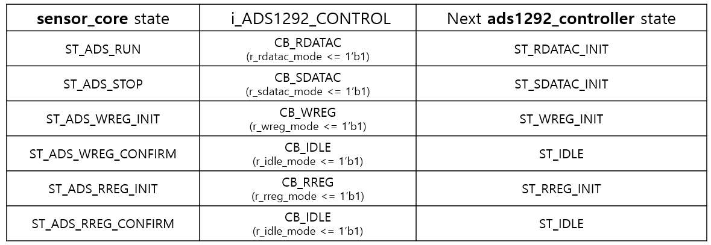

# khu_sensor

## Introduction

## Contents

* [Prerequesites](#prerequisites)
* [BlockDiagram](#BlockDiagram)
* [Modules](#Modules)
	- [khu_sensor_top](#khu_sensor_top)
	- [ads1292_controller](#ads1292_controller)
	  + [spi_master](#spi_master)
	- [mpr121_controller](#mpr121_controller)
	  + [i2c_master](#i2c_master)
	- [sensor_core](#sensor_core)
	- [uart_controller](#uart_controller)
	  + [uart_rx](#uart_rx)
		+ [uart_tx](#uart_tx)
		+ [uart_tx](#uart_tx)
		+ [uart_tx](#uart_tx)
* [Reference](#Reference)

## Prerequisites

- Quartus II (Version 15.0)
- DE2-115 Board (Cyclone IV E, EP4CE115F29C7)
- MPR121 (Touch Sensor)
- ADS1292 (ECG Sensors)

## BlockDiagram

## Modules

## khu_sensor_top
'khu_sensor_top' module assigns pins of fpga to parameters. The parameters are used to communicate with ADS1292(SPI), MPR121(I2C), PC(UART).

## ads1292_controller
'ads1292_controller' module directly communicates with ADS1292 sensor through spi_master. States are defined in this module, and parameters are set valid to each state. The parameters defiend by reference/ADS1292/ADS1292.pdf.        

'ads1292_controller' module have six modes.       
1. Idle mode
2. SYSCMD(System Command) mode
3. WREG(Write Register) mode
4. RREG(Read Register) mode
5. RDATAC(Read Data Continue) / SDATAC(Stop Data Continue) mode
6. SPI mode          

Except Idle mode, each mode consists of detail states.

* ST_IDLE     
ST_IDLE is first state of ADS1292 after reset. Next state is decided by i_ADS1292_CONTROL transferred by sensor_core module.     
       

Some input parameters from 'sensor core' module are assigned to internal parameters, like below          

r_ads_command <= i_ADS1292_COMMAND;          
r_ads_reg_addr <= i_ADS1292_REG_ADDR;   -   it will be used in ST_WREG_INIT, ST_RREG_INIT state.          
r_ads_data_in <= i_ADS1292_DATA_IN;   -   it will be used in ST_WREG_SEND_REG_NUM state.          

* SYSCMD(system Command) mode
  - ST_SYSCMD_INIT       
    In this state, opcode is transferred to spi_master for system configuration.       
		There are four conditions in this state.          
		1. r_ads_command == CM_START          
		2. r_ads_command == CM_STOP            
		3. r_ads_command == CM_RESET              
		4. else(same with r_ads_command == CM_RDATAC or CM_SDATAC)                   

  	But we don't use 1, 2, 3 condition because r_ads_command will never come to CM_START or CM_STOP or CM_RESET.
		As mentioned above, two methods are defined in ADS1292's start/stop/reset : use opcode <or> use physical sensor pin(start pin, reset pin) through tuning.
		Our chip is remodeled to have start pin and reset pin and these pins can be controlled directly by DE2-115, so we don't need to use opcode for start, stop, reset.       
		So we use this state only for CM_RDATAC or CM_SDATAC, each transferred by ST_RDATAC_INIT or ST_SDATAC_INIT.                            

  - ST_SYSCMD_SEND_CMD

* WREG(Write Register) mode
  - ST_WREG_INIT       
		This state is start of writing register. 'r_spi_data_in' corresponds to DIN(Data Input) of datasheet. According to Table 13 of datasheet, DIN has to be 8'b010rrrrr, rrrrr meaing register address being writed.                
		'010' is defiend as 'OP_WRITE_REG' as PARAMETER at upper part of code, and 'rrrrr' corresponds to r_ads_reg_addr, which is assigned by i_ADS1292_REG_ADDR received from sensor_core's ST_ADS_WREG_INIT state.            
		'r_spi_data_in' is sent to spi_master module, with 'r_spi_data_in_valid' used to generating sclk and MOSI(opcode 8'b010rrrrr in this case).                   
		After sending to spi_master module, state moves to ST_WREG_SEND_REG_ADDR.

  - ST_WREG_SEND_REG_ADDR            
		This state is divided by whether 'w_spi_data_in_ready' is 1'b0 or 1'b1. 'w_spi_data_in_ready' is output from 'spi_master' module.

		  w_spi_data_in_ready == 1'b0
			According to Table 13 of datasheet, one more byte is needed for opcode at WREG mode. The byte consists of 8'b000nnnnn.         
			'nnnnn means' 'the number of registers to be writen from register of 'rrrrr'' -1. We will set register one by one, so our opcode should be 8'b00000000.         
			This value is assigned to parameter 'OP_NUM_REG'.           
			So 'OP_NUM_REG' assigned to 'r_spi_data_in' and sent to 'spi_master' module.                      
			Then, because 'spi_master' module is not ready to receive (w_spi_data_in_ready == 0), r_spi_data_in_valid should be 1'b0. And state is maintained until spi_master is ready.

		  w_spi_data_in_ready == 1'b1
			Now 'spi_master' module is ready to receive data, so r_spi_data_in_valid is set to 1'b1. 'r_spi_data_in' is set same as above, 8'b00000000.            
			State is changed to ST_WREG_SEND_REG_NUM.                

  - ST_WREG_SEND_REG_NUM           

		- w_spi_data_in_ready == 1'b0        
			Just wait until 'spi_master' is ready to receive the data maintaining state.          

		- w_spi_data_in_ready == 1'b1            
			Values to set in the register, 'r_ads_data_in', defined at ST_IDLE, is assigned to r_spi_data_in.               
			State is changed to ST_WREG_SEND_DATA.

  - ST_WREG_SEND_DATA     

* RREG(Read Register) mode
  - ST_RREG_INIT           
		This state is start of reading register. 'r_spi_data_in' also corresponds to DIN(Data Input) of datasheet. According to Table 13 of datasheet, DIN has to be 8'b001rrrrr, rrrrr meaing register address being read.                
		'001' is defined as 'OP_READ_REG' as PARAMETER at upper part of code, and 'rrrrr' corresponds to r_ads_reg_addr, which is assigned by i_ADS1292_REG_ADDR received from sensor_core's ST_ADS_RREG_INIT state.               
		'r_spi_data_in' is sent to spi_master module, with 'r_spi_data_in_valid' used to generating sclk and MOSI(opcode 8'b001rrrrr' in this case).                   
		After sending to 'spi_master' module, state moves to ST_RREG_SEND_REG_ADDR.      

  - ST_RREG_SEND_REG_ADDR          
		This state is divided by whether 'w_spi_data_in_ready' is 1'b0 or 1'b1. 'w_spi_data_in_ready' is output from 'spi_master' module.

		+ w_spi_data_in_ready == 1'b0           
			Just wait until 'spi_master' module is ready to receive the data maintaining state.

		+ w_spi_data_in_ready == 1'b1           
			According to Table 13 of datasheet, one more byte is needed for opcode at RREG mode. The byte consists of 8'b000nnnnn.           
			'nnnnn' means 'the number of registers to be read from register of 'rrrrr'' -1. We will read register one by one, so our opcode should be 8'b00000000.        
			This value is assigned to parameter 'OP_NUM_REG'.             
			So 'OP_NUM_REG' assigned to 'r_spi_data_in' and sent to 'spi_master' module.             
			Now 'spi_master' module is ready to receive data, so r_spi_data_in_valid is set to 1'b1.            
			State is changed to ST_RREG_SEND_REG_NUM.           

  - ST_RREG_SEND_REG_NUM     
  - ST_RREG_GET_DATA     
  - ST_RREG_WAIT_SCLK

* RDATAC(Read Data Continue) / SDATAC(Stop Data Continue) mode    
  - ST_RDATAC_INIT     
  - ST_RDATAC_WAIT_DRDY     
  - ST_RDATAC_WAIT_SETTILING_TIME     
  - ST_RDATAC_WAIT_SETTLED_DATA     
  - ST_RDATAC_WAIT_DRDY_PULSE     
  - ST_RDATAC_GET_DATA     
  - ST_RDATAC_WAIT_SCLK     
  - ST_SDATAC_INIT  

* SPI mode   
  - ST_SPI_SELECT     
  - ST_SPI_CLK_WAIT     

### spi_master
SPI settings are CPOL = 0 and CPHA = 1 according to datesheet

## mpr121_controller
### i2c_master

## sensor_core
* ADS1292
  - ST_ADS_WREG_CONFIRM                
	This state controls writing value in register(register setting).
	If ADS1292 is busy, ADS1292's state remains here and ads1292_controller's state change to ST_IDLE.
	When ADS1292 is not busy, state changes to ST_ADS_SETTING and register setting task is continued.

## uart_controller
## uart_rx
## uart-tx

## Reference
[ADS1292 Datasheet](./reference/ADS1292/ADS1292.pdf)
