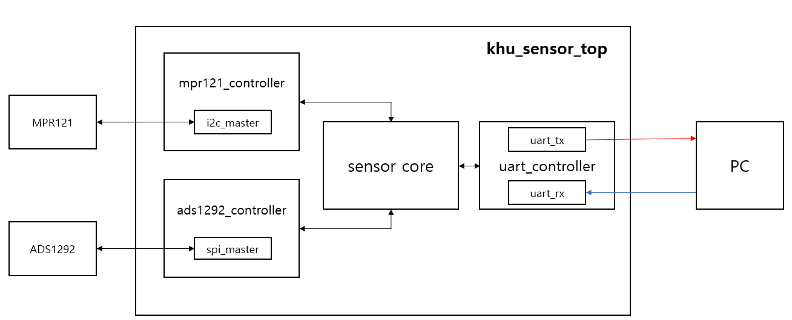
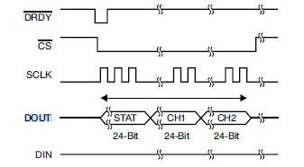
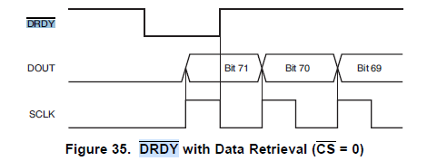

<h1 align="center"> KHU_SENSOR </h1>

# Environment

 -Altera DE2 Cyclone 4(EP4CE115F29C7)

 -***Italic***: module name

 -**Bold**: reg or wire name

# Content

[1. How ADS works](#how-ads-works)

[2. How ADS stops](#how-ads-stops)

[3. How to run MPR ](#how-mpr-works)

[4. Module Detail](#module-detail)

- - -

# How ADS works

 Through wire **UART_RXD** from PC,  8 kind of controls are available.(list below)

|| Command | byte |
|---| ---|---|
|1|UART_SG_MPR_SEND_DATA| 8'h4D |
|2|UART_SG_MPR_READ_REG| 8'h6D |
|3|UART_SG_ADS_SEND_DATA| 8'h41 |
|4|UART_SG_ADS_READ_REG| 8'h61 |
|5|UART_SG_RUN| 8'h52 |
|6|UART_SG_STOP| 8'h53 |
|7|UART_SG_ADS_FINISH| 8'h46 |
|8|UART_SG_MPR_FINISH| 8'h66 |

But just by sending 8'h52 which is **RUN** , precedure of setting register and exporting output begins automatically. So this README.md will only treat **Run** mode

Getting 8'h52 through [uart_rx.v](#uart_rx.v), **w_uart_data_ra_valid** becomes 1'b1 for a cycle and satifies condition
   * **w_uart_data_ra_valid : let FPGA know just got finished receiving data through uart completely**

<pre>
<code>
//uart_controller.v

if(w_uart_data_rx_valid) begin
              if(w_uart_data_rx == UART_SG_RUN) begin
                o_UART_DATA_RX[15:8] <= w_uart_data_rx;
                o_UART_DATA_RX_VALID <= 1'b1;
                r_pstate <= ST_IDLE;
              end
</code>
</pre>

**w_uart_data_rx, w_uart_data_rx_valid** from uart_controller.v will initiate ***sensor core***   
Inside sensor core, 3 parts(**uart, sensor core, ads1292**) will have it's own sequential logic

> uart SL: as a result of ***ST_UART_RX***, reg **r_run_mode** <=1'b1 and reg **r_ads_read_start** <=1'b1.   
> sensor core SL: handle [chip set](#chip-set) and [run set](#run-set)   
> ads1292 SL :  details of **chip set** and **run set** are executed here

First, initiate [chip set](#chip-set) process. when chip set success, FPGA gets **r_ads_chip_set_done<=1'h1** (at sensor_core)     
This will make **o_CHIP_SET<=1b'1**(meaning chip setting is done) and allows to move sensor core state to ***ST_CORE_STANDBY***.   
<pre>
<code>
ST_CORE_STANDBY:
	begin
	if(r_run_mode) begin
	   if(!r_ads_run_set_done) r_ads_run_set <= 1'b1;
                   else r_ads_is_reading <= 1'b1;
	end
</code>
</pre>

Second, as **r_ads_is_reading** from 'sensor_core SL' becomes **1'b1**, ads1292 SL start [run_set](#run-set) process.     
When **Run-set** is done, sensor core will recieve **i_ADS1292_DATA_READY** high(1'b1) and **i_ADS1292_DATA_OUT[71:0] and this will make **o_CORE_BUSY** high(1)   

Third, at state ***ST_ADS_RDATAC_INIT, ST_ADS_RDATAC_DATA_PROCESS***, due to condition satisfaction, assign **r_ads_data_convert[31:0],r_ads_data_send_ready**    
   * **r_ads_data_convert[31:0] ** : {8b'0, i_ADS1292_DATA_OUT[23:16], i_ADS1292_DATA_OUT[15:8], i_ADS1292_DATA_OUT[7:0]}    
   * **r_ads_data_send_ready** : finished assign neccessary data (In our case, CH2 data which is 24 bits),   

Fourth, at UART SL state ***ST_UART_STANDBY*** , export data **o_UART_DATA_TX[39:0], o_UART_DATA_TX_VALID** to **uart_controller.v**
   * **o_UART_DATA_TX_VALID** : signal that inititate uart_tx    
   * **o_UART_DATA_TX[39:0] ** : {UART_SG_ADS_SEND_DATA, r_ads_data_convert}    
      * UART_SG_ADS_SEND_DATA : in our code it is 8'h41, it will just work as header for PC

Fifth, as **o_UART_DATA_TX_VALID** goes high(1) send data through [uart_tx](#uart-tx.v)

Then from now on, process after **Run set** will repeated and keep export 72bits data to sensor core!!.     
And It is technically everything you need to know to Run ADS!!     

- - -

# How ADS stops

The way ADS stop is very similiar to the way ADS works.  

From PC, send 8bit data  8'h53 to give stop signal to FPGA     
Of course, stop signal is supposed to import while ADS is running( **i_CORE_BUSY** on high(1) state)

This stop signal will effect all three SL inside  **sensor_core.v**, and most important SL is ADS SL!!     
   *  **uart** : assign all **r_run_mode, r_ads_read_start** low(0)    
   *  **sensor core** : assign **r_ads_run_set, r_ads_is_reading** low(0)     

As I mentioned, ADS is currently on running mode, so state of ADS SL should be either **ST_ADS_RDATAC_INIT** or **ST_ADS_RDATAC_DATA_PROCESS**    
at state **ST_ADS_RDATAC_INIT**, because **r_ads_run_set** is low(0) next state will be ***ST_ADS_STOP***

Then, **o_RUN_SDATAC** control command goes to ***ads1292_controller.v***     
Again, ADS is currently on running mode, state at ADS1292_controller.v should be either **ST_RDATAC_WAIT_DRDY, ~ ~ ~**.

<pre>
<code>
ST_RDATAC_WAIT_DRDY:
begin
	o_ADS1292_RDATAC_READY <= 1'b0; // wait 2 clock to turn off since sensor_core's clock is 25MHz-YHM
	if(i_ADS1292_DRDY) begin
		if(r_lstate == ST_RDATAC_INIT) r_pstate <= ST_RDATAC_WAIT_SETTILING_TIME;
		else r_pstate <= ST_RDATAC_WAIT_DRDY_PULSE;
	end else begin
		if (r_sdatac_mode) r_pstate <= ST_SDATAC_INIT;
		else r_pstate <= ST_RDATAC_WAIT_DRDY;
	end
end
</pre>
</code>

After this, ads1292_controller.v will send command using MOSI communication.    
>    while on move to ***ST_SYS_SENDCMD*** for MOSI, you'll easily see **if(i_ADS1292_DRDY) r_pstate <= ST_RDATAC_WAIT_DRDY** code    
>    this code is added to consider keep out zone of DRDY pulse.    

When command is sent, to tell FPGA about the status, export **o_ADS1292_START, o_ADS1292_RDATAC_READY,o_ADS1929_BUSY, o_SPI_CSN**    
  * o_ADS1292_START: <- 1'b0 turned off the device    
  * o_ADS1292_READY: <- 1'b0 device not ready to work     
  * o_ADS1292_BUSY: <- 1'b0 device ready to do anything    
  * o_SPI_CSN: <- 1'b1  In condition Chip Select high device can not get any command.    
    * **Before taking CSN high always wait 4 * t_clk(512kHz) == t_MOD or more cycles.

That's technically all for stopping ADS. sensor core stays idle until new command issued from PC   

# How MPR Works

**pretty much same with ADS procedures, so skipped **

- - -
- - -

## Chip Set

as a result of ***ST_CORE_START*** from sensor_core.v and code below, chip set begins   

<pre>
<code>
always @ ( posedge i_CLK, posedge i_RST ) begin
		if(i_RST) o_CHIP_SET <= 1'b0;
		else o_CHIP_SET <= r_mpr_chip_set_done & r_ads_chip_set_done;
	end
</code>
</pre>

Default setting of registers are below (check detail description at ADS1292 datasheet)

| Address | Name | Data|
|---|---|---|
|01h|ADS_CONFIG_1_REG | 8'h02 |
|02h|ADS_CONFIG_2_REG | 8'hA0 |
|03h|ADS_LOFF_REG | 8'h10 |
|04h|ADS_CH1SET_REG| 8'h02 |
|05h|ADS_CH2SET_REG| 8'h00 |
|06h|ADS_RLD_SENS_REG|8'h63 |
|07h|ADS_LOFF_SENS_REG|8'h0F |
|08h|ADS_LOFF_STAT_REG|8'h00 |
|09h|ADS_RESP1_REG|8'h02 |
|0Ah|ADS_RESP2_REG|8'h03 |
|0Bh|ADS_GPIO_REG|8'h00|

#### Procedure

1. At state ***ST_ADS_SETTING***, assign **r_asd_first_param, r_ads_second_param**     
   * **r_ads_first_param** : 8 bits representing **address** of register to set    
   * **r_ads_second_param** : 8 bits representing **data** to set at designated register      

2. outputs of sensor core(**o_ADS1292_CONTROL, o_ADS1292_REG_ADDR, o_ADS1292_DATA_IN**) goes to ads1292_controller	 
   * **o_ADS1292_COMMAND** : default value for this reg is 1'b0, but later when using command input for wakeup and standby, no need for this

3. Inside the [ads1292_controller](#ads1929_controller.v), send 3 bytes data using SPI [MOSI](#mosi) comunication    
   * First Byte: 010r rrrr    
     * 010: meaning **write**    
     * r rrrr: address of register    
   * Seconde Byte: 0000_0000
     * meaning how many continuous register we will set start from r rrrr (available: 0~9)    
     (we will write data to register one by one)     
   * Third Byte: 8 bit default data users wanna set

4. After MOSI SPI communication, wait 4/(t_clk==512kHz) = 4/512k clocks for CSN to go high.
   * we are using 50M clock for FPGA, so at least wait (4/512k)/(1/50M)=390.625 cycles for CSN

5. Setting data is done and export **o_ADS1292_Busy, o_SPI_CSN** to let FPGA know it's finished.
   * **o_ADS1292_Busy** : whether ADS is working on something(YES=>1'b1, NO=>1'b0)    
   * **o_SPI_CSN** : whether we are working on this specfic chip(YES=>1'b0, NO=>1'b1)    

6. Sensor_core.v will get **i_ADS1929_Busy** 1'b0 and start chip setting with next register.    
<pre>
<code>
ST_ADS_WREG_CONFIRM:
begin
	o_ADS1292_CONTROL <= ADS_CB_IDLE;
	if(i_ADS1292_BUSY) r_ads_pstate <= ST_ADS_WREG_CONFIRM;
	else begin
	~~if (r_ads_lstate == ST_ADS_SETTING)~~ r_ads_pstate <= ST_ADS_SETTING;
	end
end
</code>
</pre>

7. when all registers setting are done let FPGA know it by making **r_ads_chip_set_done** high(1'b1)

- - -

- - -

## Run set

As **r_ads_is_reading** becomes 1'b1 at ***sensor_core.v*** Run set Initiates

There are two methods of getting data, using RDATA and RDATAC   
  * RDATA: read data once when requested    
  * RDATAC: read data continuously once requested

Our source is using **RDATAC** so far.  ~~might later fixed~~

Also, we need to start ads1292 before running, this can be done by either command or pin
  * Command: send START command and keep START pin low(0) until the STOP command is issued
  * Pin: set Start pin High(1)

Our source are using Pin way.

#### Procedure

1. At ads1292 Sequential Logic state ***ST_ADS_RUN***, export **o_ADS1292_CONTROL<=ADS_CB_RDATAC** control signal.

2. Control signal goes into ***ads1292_controller.v*** and begin **r_rdatac_mode** .

3. At state ***ST_SYSCMD_INIT***, begin [MOSI](#mosi) communication with **r_spi_data_in, r_spi_data_in_valid**    
  * **r_spi_data_in** : FPGA will shoot 8'h10( Byte representing RDATAC)
  * **r_spi_data_in_valid** : Triggering clock for SPI communication.

4. At state **ST_SYSCMD_SEND_CMD**, wait till MOSI SPI communication ends.	   
  * **i_ADS1292_DRDY** : FPGA is trying to send data, so stays low(0)

<pre>
<code>
ST_SYSCMD_SEND_CMD:
	begin
	if(r_lstate != ST_SDATAC_INIT) begin
		if(!w_spi_data_in_ready) begin
			r_spi_data_in_valid <= 1'b0;
			r_pstate <= ST_SYSCMD_SEND_CMD;
		end else begin
			if(r_lstate != ST_RDATAC_INIT) r_lstate <= ST_SYSCMD_SEND_CMD;
			r_pstate <= ST_SPI_SELECT;
		end
	end else begin
		if(i_ADS1292_DRDY) r_pstate <= ST_RDATAC_WAIT_DRDY;		//DRDY is mapped to pin!!! from ADS
		else begin
			if(!w_spi_data_in_ready) begin
				r_spi_data_in_valid <= 1'b0;
				r_pstate <= ST_SYSCMD_SEND_CMD;
			end else r_pstate <= ST_SPI_SELECT;
		end
	end
end
</code>
</pre>

5. Next, at ***ST_RDATAC_WAIT_DRDY*** state, because  current **r_lstate** is ***ST_RDATAC_INIT***, moves to ***ST_RDATAC_WAIT_SETTLING_TIME***

  

5-1. The time needed for converter to output fully settled data when **START** pin goes high is called **Settling time**  (need  once when OPCODE changes)
  * In our case, we setted **LOFF STAT** 8'b0F and **CONFIG1[2:0]** 3'b010   
     * CONFIG[2:0] == 3'b010 : settling time will be **1028 x t_mod**  with one t_mod uncertainty
     * LOFF STAT[7]=CLK_DIV == 0 : t_mod = 4 x t_clk, default f_clk is 512 kHz -> f_mod = f_clk / 4

5-2. So, according to **5-1** and we are using 50M kHz for general, cycle needed can be calculated      
  * {(1028+2) x t_mod} / (1/ CLK_50M) = 1030 x ( 4 x (1 / 512 * 1000) ) * 50 * 1,000,000 = 402,338.6    
    * +2: Considering uncertainty

<pre>
<code>
ST_RDATAC_WAIT_SETTLING_TIME:
begin
	if(r_clk_counter > 32'd402318) begin //402318
		r_clk_counter <= 32'b0;
		r_pstate <= ST_RDATAC_WAIT_SETTLED_DATA;
	end else begin
		r_clk_counter <= r_clk_counter + 1'b1;
		r_pstate <= ST_RDATAC_WAIT_SETTILING_TIME;
	end
end
</code>
</pre>

6. After settling is done, wait for 3 t_DR for setted data to be done(at ***ST_RDATAC_WAIT_SETTLED_DATA*** state.)    
  *  Reference - ADS1292 - ADS1292.pdf p.31 Settling time      
      > Note that when START is held high and there is a step change in the input signal, it takes 3 t_DR for the filter to settle to the new value.     
      > Settled data are available on the fourth DRDY pulse.

7. Now, ads1292 is ready to export **DOUT**    
     * **DOUT**: The data output pin (DOUT) is used with SCLK to read conversion and register data from ADS1292
     * 24 status bits+ 24bits x 2 channels= 72 bits    
       * MSB of DOUT data is clocked out on the first SCLK rising edge
       * at RDATAC mode, DOUT output also indicates when new data are available
       * **Status bits**: 1100 + LOFF_STAT[4:0] + GPIO[1:0] + 13'0s     

  

8. To get data from ADS through [MISO](#miso) , FPGA has to send **r_spi_data_in_valid** to initiate sclk. But there is minimum pulse time for **DRDY** staying high(1) which is t_mod
   * **t_mod** : as mentioned earlier, f_mod== 4/ f_clk==4 / 512 kHz == 0.0000078125    
       * cycle needed for t_mod : (f_mod) / (1/50 MHz)=390.625      
   * **DRDY** : Signal telling new conversion data are ready     
      * DRDY must returns high on the first SCLK falling edge    
      * so when, 72bits are ready, DRDY becomes low(0)

  

<pre>
<code>
ST_RDATAC_WAIT_DRDY_PULSE:
begin
	if(r_clk_counter > 32'd391) begin
		if(i_ADS1292_RDATAC_READ_START) begin
			r_clk_counter <= 32'b0;
			r_spi_data_in <= 8'b0; // send dummy for reading
			r_spi_data_in_valid <= 1'b1; // active sclk for reading
			r_pstate <= ST_RDATAC_GET_DATA; // wait until read start High(1)
		end else r_pstate <= ST_RDATAC_WAIT_DRDY_PULSE;
	end else begin
		r_clk_counter <= r_clk_counter + 1'b1;
		r_pstate <= ST_RDATAC_WAIT_DRDY_PULSE;
	end
end
</code>
</pre>

9. Now ads1292 will continuously send data to FPGA and FPGA will get data through [MISO](#miso) communication    
  * **Data Recieving State** : state ***ST_RDATAC_WAIT_DRDY_PULSE + ST_RDATAC_WAIT_SCLK***, initiate sending by giving signal **r_spi_data_in_valid** high(1)    

10. Every single state ***ST_RDATAC_WAIT_DRDY_PULSE, ST_RDATAC_WAIT_SCLK*** will give only 8 bits at one time, so at state ***ST_RDATAC_GET_DATA***, keep shift **w_spi_data_out** and fill 72 bits  	  

<pre>
<code>
ST_RDATAC_GET_DATA:
begin
	r_lstate <= ST_RDATAC_GET_DATA;
	r_spi_data_in_valid <= 1'b0;
	if(r_lstate != ST_SDATAC_INIT) begin
		if(w_spi_data_out_valid) begin
			o_ADS1292_DATA_OUT <= {o_ADS1292_DATA_OUT[63:0], w_spi_data_out};
			if(r_data_counter > 4'd7) begin // read 8 byte, since we already triggerd one byte sclk in ST_RDATAC_WAIT_DATA_SETTLING
				r_data_counter <= 4'b0; // reset data counter
				o_ADS1292_RDATAC_READY <= 1'b1; // data is ready
				r_pstate <= ST_SPI_SELECT;
			end else r_pstate <= ST_RDATAC_WAIT_SCLK;
		end else r_pstate <= ST_RDATAC_GET_DATA;
	end else r_pstate <= ST_SDATAC_INIT;
end
</pre>
</code>

11. When 72 bits are all filled, export output **o_ADS1292_DATA_OUT[71:0], o_ADS1292_RDATAC_READY** to sensor_core    
   * **o_ADS1292_RDATAC_READY** : goes high(1) when 72bit data are all received

# Module Detail

## UART

- - -

### my_pll.v

- - -

designed phase locked loop

* input: 50M clock

* output: 5M, 25M, 100M clock

- - -

### uart_controller.v

* input clock: 25M  - tried to match with MPR's clock 25M

* baud rate: 115200

* UART_CLKS_PER_BIT: 25M/115200 = 217

##### - LUT FOR uart_controller.v

|Parameters|hex|definition|
|---:|---:|---:|
|UART_SG_RUN|8'h52|Turn devices on |
|UART_SG_STOP|8'h53|Turn devices off|
|UART_SG_ADS_FINISH|8'h46| ADS Data ready|
|UART_SG_ADS_READ_REG|8'h61| ADS Register read|

##### - LUT FOR uart_controller state

|State|hex|definiton|
|---:|---|---|
|ST_IDLE|8'd0| checking 'w_uart_data_Rx' stage|
|ST_RX_READ_REG_ADDR|8'd4| PC wants to read REG, so concentrate two 'w_uart_data_Rx'|

> uart_controller.v verifies data sent from PC

### uart_tx.v

* **i_UART_DATA_TX_VALID** bit high(1) will initiate uart_tx

* In our case there are two types of tx data     
  * **40Bits** : when header is **ADS_SEND_DATA**
  * **24Bits** : when header is **MPR_SEND_DATA, ADS_READ_DATA, MPR_READ_DATA**

* The only different of two case is how many reps uart_tx has to repeat.(uart can send or receive 8 bits at once)

* So, from [39:32] to [7:0] start sending it by giving signal **r_uart_data_tx_valid** high(1)    
  * **r_uart_data_tx_valid** : data setting for uart tx is ready, begin uart_tx communication

* **o_Tx_Active** : always goes high(1) during communication

* **o_Tx_Serial** : single bit data that really sent to PC. consisting **r_Tx_Data's ** from LSB to MSB
### uart_rx.v

* **i_Rx_Serial** (i_UART_RXD==UART_RXD) inputs low to begin ***UART_RX***

* After two cycle **i_Rx_Serial(i_UART_RXD)** replicated to **r_Rx_Data**  

* When **r_Clock_count** reaches (CLKS_PER_BIT-1)/2=108, change state to **s_RX_START_BIT**

* **r_Rx_Byte[7:0]** getting filled with **r_Rx_Data** from LSB to MSB (r_Rx_Data doesn't have to be low this time)

* After **r_Rx_Byte[7:0]** is filled, change state and wait (CLKS_PER_BIT-1) cycle

* When **r_Clock_count** reaches (CLKS_PER_BIT-1), state changes with register **r_Rx_Dv** high,

* At s_CLEANUP state change register '**r_Rx_Dv**' back to low

* assign **o_Rx_DV, O_Rx_Byte** with **r_Rx_DV, r_Rx_Byte**

|r_SM_Main(State) | s_IDLE | s_RX_START_BIT | s_RX_DATA_BITS | s_RX_STOP_BIT | s_CLEANUP |
|----------:|--------:|----------------:|----------------:|---------------:|-----------:|
|Cycle Cost|-|(CLKS_PER_BIT-1)/2|CLKS_PER_BIT * 8 |CLKS_PER_BIT|1|
|r_Rx_DV|0->0|0->0|0->0|0->1|1->0|
|r_Rx_Data|0|0|1,0|1,0|1,0|
|r_Rx_Byte|00000000|00000000|hgfedcba(start from LSB)|-| -|

 >uart_rx.v send 8bit data PC send, plus makes output r_Rx_Dv high right after 1 byte is filled. goes back to 0 at next cycle

### sensor_core.v

- - -

### spi_master.v

* input clock: 50M

* spi_mode=1, (CPOL,CPHA)=(0,1)

* CLKS_PER_HALF_BIT= 49,

 - i_CLK/(CLKS_PER_HALF_BIT*2)=f_CLK=512kHz

##### MOSI
>	> as **i_TX_DV(r_spi_data_in_valid)** goes high for a moment, **r_SPI_CLK_Edges** becomes 16, **o_TX_Ready** becomes 1'b0     
> 	> to prevent unwanted data change, we used cycle delay

<pre>
<code>
 always @(posedge i_Clk or negedge i_Rst_L)
  begin
    if (~i_Rst_L)
    begin
      r_TX_Byte <= 8'h00;
      r_TX_DV   <= 1'b0;
    end
    else
      begin
        r_TX_DV <= i_TX_DV; // 1 clock cycle delay !!!  
        if (i_TX_DV)
        begin
          r_TX_Byte <= i_TX_Byte;
        end
      end
  end
</code>
</pre>

> 	> after **i_TX_DV** becomes low again, make SPI it's own 16 cycle using reg **r_Trailing_Egde, r_Leading_Egde**

  

> 	> now at the Edge of spi_clock send single bit of input Byte **i_TX_Byte** from MSB to LSB

<pre>
<code>
 else if ((r_Leading_Edge & w_CPHA) | (r_Trailing_Edge & ~w_CPHA))
      begin
        r_TX_Bit_Count <= r_TX_Bit_Count - 1;
        o_SPI_MOSI     <= r_TX_Byte[r_TX_Bit_Count];
 end
</code>
</pre>  

>	> when data(**o_MOSI**) send is done, give **o_TX_Ready** 1'b1

###### MISO

>	> When **i_TX_DV** turns to high(1'b1),ini     
>	> Start filling **o_RX_Byte[7:0]** with **i_SPI_MISO[0:0]** ( will cost 7 cycle)     

<pre>
<code>
 if (o_TX_Ready)
      begin
        r_RX_Bit_Count <= 3'b111;
      end
      else if ((r_Leading_Edge & ~w_CPHA) | (r_Trailing_Edge & w_CPHA))
      begin
        o_RX_Byte[r_RX_Bit_Count] <= i_SPI_MISO;
        r_RX_Bit_Count            <= r_RX_Bit_Count - 1;
        if (r_RX_Bit_Count == 3'b000)
        begin
          o_RX_DV   <= 1'b1;   // Byte done, pulse Data Valid
        end
      end
</code>
</pre>

>	> When **o_RX_Byte** is all filled, export **o_RX_DV <= 1'b1**

### ads1292_controller.v

* input clock: 50M

* **o_ADS1292_START** : 1'b1 when ads starts, start here means when ads returns data. So at RREG or WREG  command, **o_ADS1292_START** goes 1'b0

* **o_SPI_CSN** : meaning chip select, there are various chips(ex. ADS1292, ADS1291 ... ) and you can only communicate with one chip using SPI protocol.
   - After the serial communication is finished, ***always wait four or more tCLK cycles*** before taking CS high    
   - When CS is taken high, the serial interface is reset(SCLK and DIN are ignored,and DOUT enters a high-impedance state)

* **i_ADS1292_DRDY** : output of ads1292, meaning new conversion data are ready

### mpr121_controller.v

### i2c_master.v

### khu_sensor_top.v(top module)
