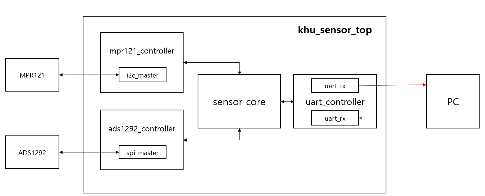
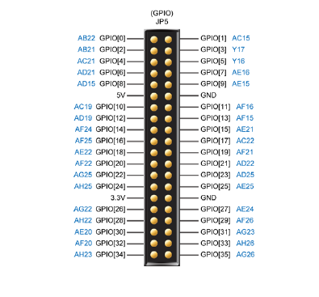
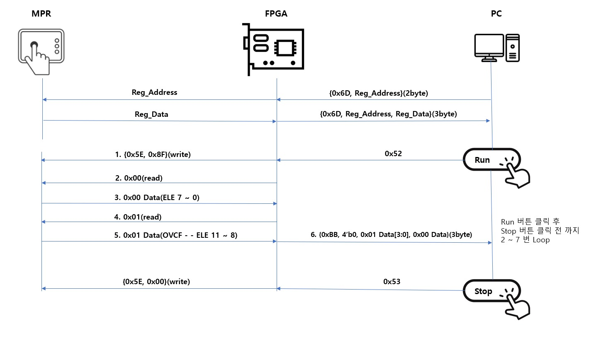
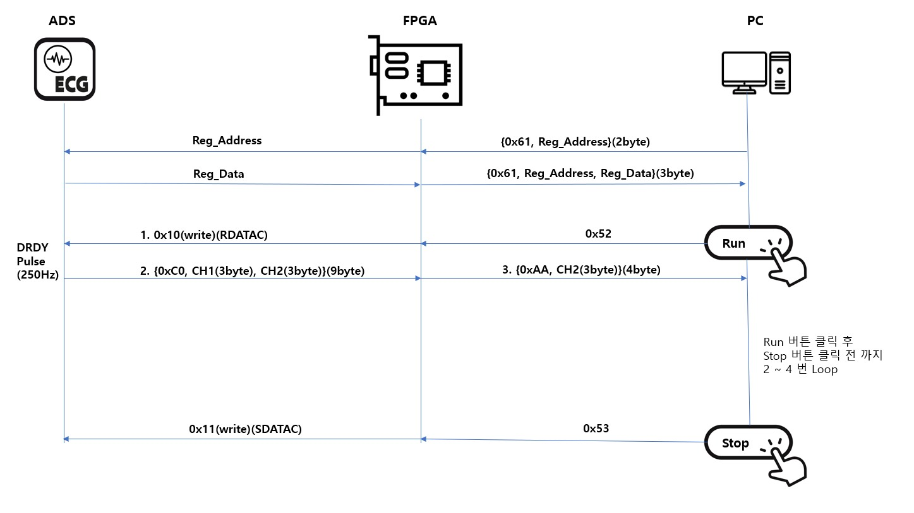

# khu_sensor

khu_sensor is a module on a FPGA board that communicates with MPR121 and ADS1292 and sends sensing data to PC through RS232.

---
## Contents
* [Introduction](#Introduction)
  - [Prerequisites](#Prerequisites)
  - [Block_Diagram](#Block_Diagram)
  - [How khu_sensor works](#Operation_Manual)
* [Modules](#Modules)
	- [khu_sensor_top](#khu_sensor_top)
  - [mpr121_controller](#mpr121_controller)
	- [ads1292_controller](#ads1292_controller)
	  + [spi_master](#spi_master)

	  + [i2c_master](#i2c_master)
	- [sensor_core](#sensor_core)
	- [uart_controller](#uart_controller)
	  + [uart_rx](#uart_rx)
	  + [uart_tx](#uart_tx)
* [Reference](#Reference)
  - [mpr121_controller](#Reference_mpr121_controller)
  - [ads1292_controller](#Reference_ads1292_controller)
  - [sensor_core](#Reference_sensor_core)
  - [uart_controller](#Reference_uart_controller)


## Introduction

### Prerequisites

- Quartus II (Version 15.0)
- Altera DE2-115 Board (Cyclone IV E, EP4CE115F29C7)
- USB-Blaster
- RS232
- MPR121 (FreeScale) (Touch Sensor)
- ADS1292 (Texas Instrument) (ECG Sensor)
- Program which can be transmitted or received bytes by Serial port  
  // In this repository, we have Qt5 program(khu_sensor_ui) to control FPGA.   
  (or SerialPacketAnalysisSystem.exe that only operates on Windows)   
  **_Caution_** : **Qt5 Program is not fully implemented yet.**

### Block_Diagram


### Operation_Manual
For operating the module you must make sure that all wires and cables is connected with your FPGA board correctly.  
(you can modify Pin Assignments through Quartus.)  

First, Compare to our PIN Asssignment.  
  

|MPR121|||ADS1292|||
|----|----|----|----|----|----|
|VIN|5V||VCC|3.3V||
|GND|GND||DGND|GND||
|SCL|GPIO\[8\]|AD15|SCLK|GPIO\[26\]|AG22|
|SDA|GPIO\[9\]|AE15|DOUT(MISO)|GPIO\[27\]|AE24|
||||DIN(MOSI)|GPIO\[28\]|AH22|
||||DRDYN|GPIO\[29\]|AF26|
||||PWDN/RESETN|GPIO\[30\]|AE20|
||||START|GPIO\[31\]|AG23|
||||CSN|GPIO\[32\]|AF20|

#### Steps

1. send 'R'(8'h52) to the FPGA Board through Serial communication Program what you use.

2. receive [data](./Reference/khu_sensor/Packet_Definition.pptx) from FPGA  

  - **MPR121**
    

  - **MPR121 Data Process**  
    - MPR121 Data : {24'hBB0xxx} (xxx is ELE11~0 12 bits. MSB is ELE11 and LSB is ELE0)  

    - If data is processed in the bits form in your program, you do not need to convert them to analyze which Electrode is touched.  

    - However, If data is processed in the hex form in your program, you should convert them.  

      In our Qt5 Program
      ```cpp
      QBitArray mpr_bits((t_Data.count())*8);

      // Convert from QByteArray to QBitArray
      for(int i=0; i<t_Data.count(); i++) {
        for(int b=0; b<8; b++) {
          mpr_bits.setBit(mpr_bits.count()-1-(i*8+b), t_Data.at(i)&(1<<(7-b)) );
        }
      }
      /*
      mpr_bits.at(0) -> ELE0
      mpr_bits.at(1) -> ELE1
      mpr_bits.at(2) -> ELE2
      mpr_bits.at(3) -> ELE3
      mpr_bits.at(4) -> ELE4
      mpr_bits.at(5) -> ELE5
      mpr_bits.at(6) -> ELE6
      mpr_bits.at(7) -> ELE7
      mpr_bits.at(8) -> ELE8
      mpr_bits.at(9) -> ELE9
      mpr_bits.at(10) -> ELE10
      mpr_bits.at(11) -> ELE11
      */
      ```


  - **ADS1292**
    

  - **ADS1292 Data Process**  
    - ADS1292 Data : {32'hAAxxxxxx} (ADS1292 data is 3byte and MSB(sign) is left)  

    - ADS1292 Data need to calculate to convert signed integer.

      In our Qt5 Program
      ```cpp
      // t_Data is serial data which excluded header(0xBB)
      // MSB is index 0
      data1c = t_Data.at(0);
      data2c = t_Data.at(1);
      data3c = t_Data.at(2);

      if(t_Data.at(0) > 0x7F){
          data1c = ~data1c;
          data2c = ~data2c;
          data3c = ~data3c;

          data1l = ((unsigned int)(data1c<<8)<<8);
          data2l = (unsigned int)(data2c<<8);
          data3l = (unsigned int)(data3c);

          ADS_Data = data1l|data2l|data3l;
          ADS_Data += 1;
          ADS_Data = -ADS_Data;
        } else {
          data1l = ((unsigned int)(data1c<<8)<<8);
          data2l = (unsigned int)(data2c<<8);
          data3l = (unsigned int)(data3c);
          ADS_Data = data1l|data2l|data3l;
        }
        ```
        or
        ```
        ECG_Data = (data[0]<<16)|(data[1]<<8)|(data[2]);
        ```
    - If you want to obtain more clear ECG_data, you should implement Notch Filter(BSP)(Band Stop Filter), Low Pass Filter(LPF) and High Pass Filter(HPF). Data must be filtered in order of Notch Filter, LPF, HPF.
    ||Notch Filter(BSP)|LPF|HPF|
    |----|----|----|----|
    |Sampling<br>Frequency(Hz)|250|250|250|
    |Cut-off/Middle<br>Frequency(Hz)|60|10|5|


3. If you want to stop the module, send 'S'(8'h53) to the FPGA Board through Serial communication Program what you use.

---

## Modules

### khu_sensor_top.v
khu_sensor_top is the top module of khu_sensor. The module assigns pins of fpga to wire and register. These pins are used to communicate with ADS1292(SPI), MPR121(I2C), PC(UART).  


#### Port Lists

###### SYSTEM I/0
* **input** CLOCK_50M // PIN_Y2
  - The DE2-115 board includes one oscillator that produces 50 MHz clock signal.
  - It is main clock of our modules.


* **input** KEY_0 // KEY[0] - PIN_M23
  - when it is pressed, voltage level is going to be Low(0)
  - It is main RSTN(Negative Reset) of our modules


* **output** [17:0] LEDR , [7:0]LEDG
  |LEDG|PIN|LEDR|PIN|
  |----|----|----|----|
  |LEDG[0]|E21|LEDR[0]|G19|
  |LEDG[1]|E22|LEDR[1]|F19|
  |LEDG[2]|E25|LEDR[2]|E19|
  |LEDG[3]|E24|LEDR[3]|F21|
  |LEDG[4]|H21|LEDR[4]|F18|
  |LEDG[5]|G20|LEDR[5]|E18|
  |LEDG[6]|G22|LEDR[6]|J19|
  |LEDG[7]|G21|LEDR[7]|H19|
  |||LEDR[8]|J17|
  |||LEDR[9]|G17|
  |||LEDR[10]|J15|
  |||LEDR[11]|H16|
  |||LEDR[12]|J16|
  |||LEDR[13]|H17|
  |||LEDR[14]|F15|
  |||LEDR[15]|G15|
  |||LEDR[16]|G16|
  |||LEDR[17]|H15|

  - LEDG[0] indicates initial setting of chips(MPR121, ADS1292) is done.
  - LEDG[1] indicates register setting of chips(MPR121, ADS1292) is done.
  - LEDG[2] indicates that sensor_core is running.
  - LEDR[11:0] indicates which MPR121 Electrodes are touched.
  - LEDR[16] indicates that error of MPR121 is occured.
  - LEDR[17] indicates that sensor_core is busy.


###### RS232
* **input** UART_RXD // PIN_G12
  - UART_RX of RS232 cable which receives data from PC


* **output** UART_TXD // PIN_G9
  - UART_TX of RS232 cable which transmits data to PC


###### DUT IO: MPR121 (I2C)
* **inout** MPR121_SCL // GPIO[8] - PIN_AD15
  - I2C Clock

* **inout** MPR121_SDA // GPIO[9] - PIN_AE15
  - I2C Data


###### DUT IO: ADS1292 (SPI)

* **output** ADS1292_SCLK // GPIO[26] - PIN_AG22
  - SPI Clock


* **output** ADS1292_MISO // GPIO[27] - PIN_AE24
  - SPI data from ADS1292 - Master input Slave output (read)


* **output** ADS1292_MOSI // GPIO[28] - PIN_AH22
  - SPI data to ADS1292 - Master Output Slave Input (write)


* **output** ADS1292_DRDY // GPIO[29] - PIN_AF26
  - This port indicates that new conversion data are ready when its value is Low(0).


* **output** ADS1292_RESET // GPIO[30] - PIN_AE20
  - Power-down or ADS1292 reset
  - active Low(0)


* **output** ADS1292_START // GPIO[31] - PIN_AG23
  - begin the data conversion


* **output** ADS1292_CSN // GPIO[32] - PIN_AF20
  - chip select to communicate
  - active low

_If you want to obtain more specific information, refer to [DE2-115](./Reference/DE2-115/DE2-115.pdf)_

---
### mpr121_controller.v
mpr121_controller is the module which control MPR121 chip operation. It offers Read and Write register operation through I2C communication.

#### Port Lists

##### input

* i_CLK
  - main clock


* i_RSTN       
   - reset the mpr121_controller module
   - active Low(0)


* [7:0] i_MPR121_REG_ADDR
  - MPR121 Register Address to write or read


* [7:0] i_MPR121_DATA_IN
  - data to write on MPR121 Register


* i_MPR121_WRITE_ENABLE
  - start writing operation


* i_MPR121_READ_ENABLE
  - start reading operation


##### output

* [7:0] o_MPR121_DATA_OUT
  - register data which is read from MPR121


* o_MPR121_INIT_SET
  - flag that soft reset of MPR121 is done.
  - The soft reset does not effect the i2c_master module, but make MPR121 same as POR(Power On Reset).


* o_MPR121_BUSY
  - busy flag that mpr121_controller is either on writing or reading operation


* o_MPR121_FAIL
  - flag that unexpected error is occurred during process         


##### inout
* I2C_SCL
  - I2C Clock


* I2C_SDA
  - I2C Data

#### Operation_Manual

##### Write Register
* put in 8bits Register Address to i_MPR121_REG_ADDR.

* put in 8bits Register Data to i_MPR121_DATA_IN.

* set i_MPR121_WRITE_ENABLE High(1).  
  _Caution : Do not set i_MPR121_WRITE_ENABLE and i_MPR121_READ_ENABLE High(1) at the same time._  

* The above three operations must be performed simultaneously or you should put in register address and data before setting i_MPR121_WRITE_ENABLE High(1).  

* **Make sure that set i_MPR121_WRITE_ENABLE Low(0) before the end of Writing operation.**

* o_MPR121_BUSY goes High(1) at next clock after setting i_MPR121_WRITE_ENABLE High(1).

* o_MPR121_BUSY goes Low(0) after finishing writing operation.

##### Read Register
* put in 8bits Register Address to i_MPR121_REG_ADDR.

* set i_MPR121_READ_ENABLE High(1).  
  _Caution : Do not set i_MPR121_WRITE_ENABLE and i_MPR121_READ_ENABLE High(1) at the same time._  

* The above two operations must be performed simultaneously or you should put in register address before setting i_MPR121_READ_ENABLE High(1).  

* **Make sure that set i_MPR121_READ_ENABLE Low(0) before the end of Reading operation.**

* o_MPR121_BUSY goes High(1) at next clock after setting i_MPR121_READ_ENABLE High(1).

* o_MPR121_BUSY goes Low(0) after finishing reading operation.

* After receiving 8bits register data from MPR121, the data is stored on o_ADS1292_DATA_OUT.


_If you want to obtain more specific information and operation, refer to [Reference](#Reference_mpr121_controller)_


---

---
### ads1292_controller.v
ads1292_controller is the module which control ADS1292 chip operation. It offers Read, Write register operation and Measuring Bio-potential through SPI communication.

#### Port Lists

##### input

* i_CLK
  - main clock


* i_RSTN       
   - reset the ads1292_controller module
   - active Low(0)


* [2:0] i_ADS1292_CONTROL
  - ads1292_controller's mode


* [7:0] i_ADS1292_COMMAND
  - command byte to control ADS1292
  - used only in SYSCMD mode


* [7:0] i_ADS1292_REG_ADDR
  - ADS1292 Register Address to write or read


* [7:0] i_ADS1292_DATA_IN
  - data to write on ADS1292 Register


* i_SPI_MISO
  - SPI data from ADS1292 - Master input Slave output (read)


* i_ADS1292_DRDY
  - falling edge when conversion data is ready
  - flag that indicates module should start to read 72bits data


##### output

* [71:0] o_ADS1292_DATA_OUT   
  - In RDATAC mode, 72bits Bio-potential data
  - In RREG mode, o_ADS1292_DATA_OUT[7:0] is the register data

* o_ADS1292_INIT_SET   
  - flag that initial reset of ADS1292 is done.
  - The reset does not effect the spi_master module, but make ADS1292 initial state and   being on SDATAC mode.

* o_ADS1292_DATA_READY  
  -In RDATAC mode,  flag that 72 bits data was all read and be ready to use.


* o_ADS1292_BUSY
  - busy flag that ads1292_controller is either on writing or reading operation


* o_SPI_CLK   
  - SPI Clock        


* o_SPI_MOSI
  - SPI data to ADS - Master Output Slave Input (write)


* o_ADS1292_RESET   
- Power-down or ADS1292 reset
- active Low(0)


* o_ADS1292_START  
  - begin the data conversion


* o_SPI_CSN   
  - chip select to communicate
  - active low

#### Operation_Manual

##### Write Register
* put in 8bits Register Address to i_MPR121_REG_ADDR.

* put in 8bits Register Data to i_MPR121_DATA_IN.

* set i_MPR121_WRITE_ENABLE High(1).  
  _Caution : Do not set i_MPR121_WRITE_ENABLE and i_MPR121_READ_ENABLE High(1) at the same time._  

* The above three operations must be performed simultaneously or you should put in register address and data before setting i_MPR121_WRITE_ENABLE High(1).  

* **Make sure that set i_MPR121_WRITE_ENABLE Low(0) before the end of Writing operation.**

* o_MPR121_BUSY goes High(1) at next clock after setting i_MPR121_WRITE_ENABLE High(1).

* o_MPR121_BUSY goes Low(0) after finishing writing operation.

##### Read Register
* put in 8bits Register Address to i_MPR121_REG_ADDR.

* set i_MPR121_READ_ENABLE High(1).  
  _Caution : Do not set i_MPR121_WRITE_ENABLE and i_MPR121_READ_ENABLE High(1) at the same time._  

* The above two operations must be performed simultaneously or you should put in register address before setting i_MPR121_READ_ENABLE High(1).  

* **Make sure that set i_MPR121_READ_ENABLE Low(0) before the end of Reading operation.**

* o_MPR121_BUSY goes High(1) at next clock after setting i_MPR121_READ_ENABLE High(1).

* o_MPR121_BUSY goes Low(0) after finishing reading operation.

* After receiving 8bits register data from MPR121, the data is stored on o_ADS1292_DATA_OUT.


##### Read Bio-potential Data

_If you want to obtain more specific information and operation, refer to [Reference](#Reference_mpr121_controller)_


---

## Reference

### mpr121_controller

####MPR121 Register Map  

|Register Name|Address|Value|Description|  
|----|----|----|----|
|ELE0-ELE7 Touch Status|8'h00||read only|
|ELE8-ELE11 Touch Status|8'h01||read only|
|Maximum Half Delta Rising(MHDR)|8'h2B|8'h01|d|
|Noise Half Delta Amount Rising(NHDAR)|8'h2C|8'h01|d|
|Noise Count Limit Rising(NCLR)|8'h2D|8'h0E|d|
|Filter Delay Count Limit Rising(FDLR)|8'h2E|8'h00|d|
|Maximum Half Delta Falling(MHDF)|8'h2F|8'h01|d|
|Noise Half Delta Amount Falling(NHDAF)|8'h30|8'h05|d|
|Noise Count Limit Falling(NCLF)|8'h31|8'h01||
|Filter Delay Count Limit Falling(FDLF)|8'h32|8'h00||
|Noise Half Delta Amount Touched(NHDAT)|8'h33|8'h00||
|Noise Count Limit Touched(NCLT)|8'h34|8'h00||
|Filter Delay Count Limit Touched(FDLT)|8'h35|8'h00||
|Debounce Touch & Release|8'h5B|8'h00||
|Filter/Global CDC Configuration|8'h5C|8'h10||
|Filter/Global CDT Configuration|8'h5D|8'h20||
|Electrode Configuration|8'h5E|8'h8F||
|Soft Reset|8'h80|8'h63||
|AUTO-CONFIG Control 0|8'h7B|8'h0B||
|AUTO-CONFIG Control 1|8'h7C|||
|AUTO-CONFIG Up-Side Limit|8'h7D|8'h9C||
|AUTO-CONFIG Low-Side Limit|8'h7E|8'h65||
|AUTO-CONFIG Target Level|8'h7F|8'h8C||


**not busy**   
SDA, SCL all high   
**busy**   
Start : 'Start' is change point of state when SDA changes from high to low.     
Stop : 'Stop' is change point of state when SDA changes from high to low.

## i2c_master
<pre>
<code>
Read
    __    ___ ___ ___ ___ ___ ___ ___         ___ ___ ___ ___ ___ ___ ___ ___     ___ ___ ___ ___ ___ ___ ___ ___        __
sda   \__/_6_X_5_X_4_X_3_X_2_X_1_X_0_\_R___A_/_7_X_6_X_5_X_4_X_3_X_2_X_1_X_0_\_A_/_7_X_6_X_5_X_4_X_3_X_2_X_1_X_0_\_A____/
    ____   _   _   _   _   _   _   _   _   _   _   _   _   _   _   _   _   _   _   _   _   _   _   _   _   _   _   _   ____
scl  ST \_/ \_/ \_/ \_/ \_/ \_/ \_/ \_/ \_/ \_/ \_/ \_/ \_/ \_/ \_/ \_/ \_/ \_/ \_/ \_/ \_/ \_/ \_/ \_/ \_/ \_/ \_/ \_/ SP

Write
    __    ___ ___ ___ ___ ___ ___ ___ ___     ___ ___ ___ ___ ___ ___ ___ ___     ___ ___ ___ ___ ___ ___ ___ ___ ___    __
sda   \__/_6_X_5_X_4_X_3_X_2_X_1_X_0_/ W \_A_/_7_X_6_X_5_X_4_X_3_X_2_X_1_X_0_\_A_/_7_X_6_X_5_X_4_X_3_X_2_X_1_X_0_/ N \__/
    ____   _   _   _   _   _   _   _   _   _   _   _   _   _   _   _   _   _   _   _   _   _   _   _   _   _   _   _   ____
scl  ST \_/ \_/ \_/ \_/ \_/ \_/ \_/ \_/ \_/ \_/ \_/ \_/ \_/ \_/ \_/ \_/ \_/ \_/ \_/ \_/ \_/ \_/ \_/ \_/ \_/ \_/ \_/ \_/ SP
</code>
</pre>

### Input
* cmd_address[6:0]
  * MPR121 Slave Address
  * set to 7'b1011_010(0x5A) - ADDR pin connect to Ground
* cmd_start
  * 1'b1 : i2c start
* cmd_read
  * 1'b1 : i2c read (send 0)
* cmd_write
  * 1'b1 : i2c write (send 1)
* cmd_write_multiple
  * 1'b1 : i2c write multiple (until data_in_last)
* cmd_stop
  * 1'b1 : i2c stop
* cmd_valid
  * 1'b1 : command valid
* data_in[7:0]
  * 1 byte data to MPR121 - i2c(master input)
* data_in_valid
  * valid of input data byte
* data_in_last
  * flag of last data to write (using for write multiple)
* data_out_ready
  * ready flag which indicate status that Slave finish to read 1 byte data
* prescale[15:0]      
  * set to 16'd125    
    * set prescale to 1/4 of the minimum clock period in units of input i_CLK cycles
    * prescale = Fclk / (FI2Cclk * 4) = 50M / (100k * 4) = 125
* stop_on_idle
  * set to 1'b1 - automatically issue stop when command input is not valid


### Output
* cmd_ready
  * ready to operate command
* data_in_ready
  * ready flag which indicate status that Master can receive data byte to write when Master finish to write previous data sent
* data_out[7:0]
  * 1 byte data from MPR121 - i2c(master output)
* data_out_valid
  * valid of output data byte
* data_out_last
  * flag of last data to read (In general, we don't know how much long data is)
* missed_ack
  * check nack

_refer to [MPR121](./Reference/MPR121/MPR121.pdf)_
