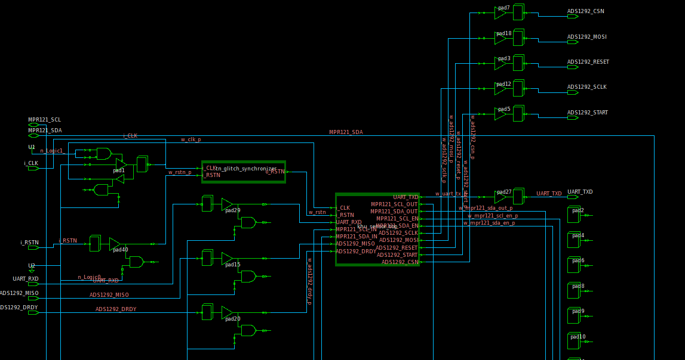
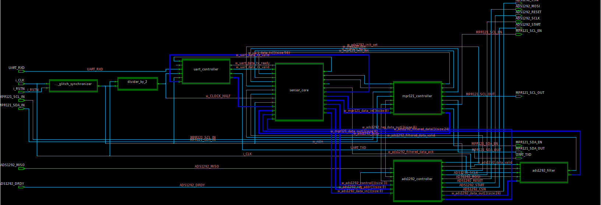
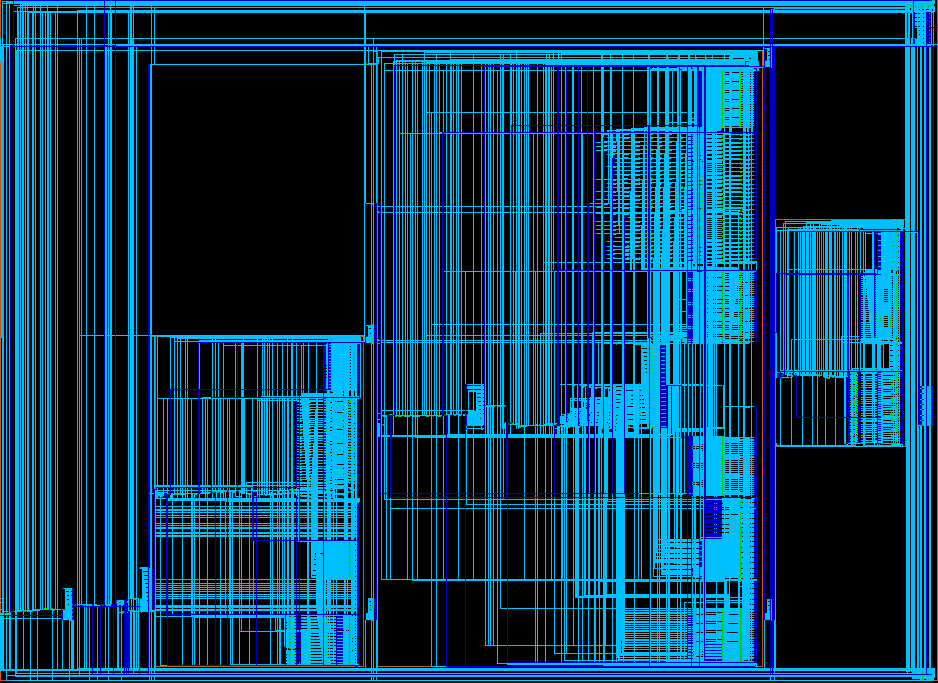
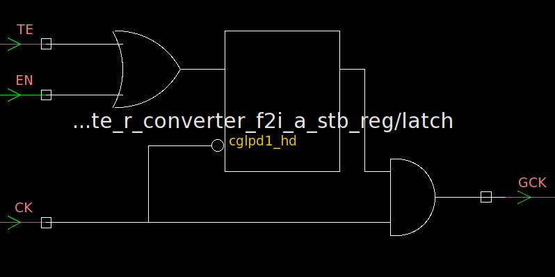
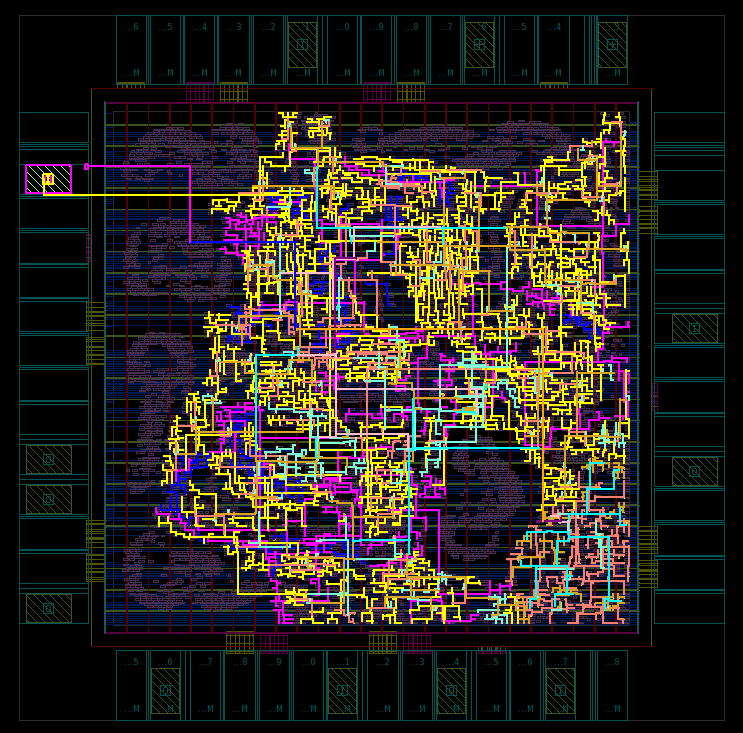

<h1 align="center"> khu_sensor </h1>

khu_sensor is a processor that communicates with MPR121 and ADS1292 and sends filtered **HoD & ECG** data to PC through RS232.  

### Design Manual [pdf]()

### khu_sensor layer

#### Final Design Specification

|  Spec    |   Value  |
|----------|----------|
| Technology | S130nm |
| Operating Condition | SS 1.08V 125°C (Worst)|
| Main Clock | 58 MHz |
| Slack | 0.0589 ns |
| Die Area |  1.4mm x 1.4mm (56 I/O PAD)  |
| Design Area |  93007.58 µm^2  |
| Power | 3.0130 mW |

### 01_RTL_Synthesis

###### khu_sensor_pad

###### khu_sensor_top

###### ads1292_filter

###### async_rstn_glitch_synchronizer

###### clock_gating_cell

#### Design Performance

|  Spec (SS 1.08V 125°C)   |   Compile  | Re-time | Clock-Gating |
|----------|------------|--------|-------------|
| Slack (ns) | 0.0 | 0.0  | 4.74  |
| Design Area (µm^2) |  91019.26  | 89087.26 | 86101.93 |
| Power (mw) | 110.4946 | 110.4860 | 3.0130 |

### 03_Physical_Synthesis

#### 00_read_design

#### 01_floorplan

#### 02_powerplan

#### 03_place_opt

#### 04_clock_opt_cts

#### 05_clock_opt_post_cts

#### 06_route

#### 07_route_opt + clock_shielding

#### 08_chip_finish

