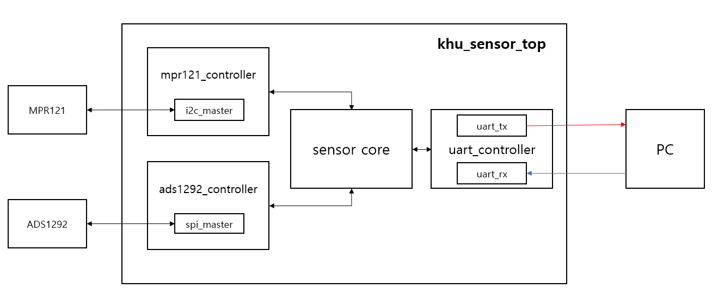

<h1 align="center"> khu_sensor </h1>

---

khu_sensor is a module on a FPGA board that communicates with MPR121 and ADS1292 and sends sensing data to PC through RS232.

---

## Contents
* [Introduction](#Introduction)
  - [Prerequisites](#Prerequisites)
  - [Block_Diagram](#Block_Diagram)
  - [How khu_sensor works](#How_khu_sensor_works)
* [Modules](#Modules)
	- [khu_sensor_top](#khu_sensor_top)
  - [mpr121_controller](#mpr121_controller)
   	+ [i2c_master](#i2c_master)
  - [ads1292_controller](#ads1292_controller)
	  + [spi_master](#spi_master)
  - [sensor_core](#sensor_core)
  - [uart_controller](#uart_controller)
	  + [uart_tx](#uart_tx)
	  + [uart_rx](#uart_rx)
  - [my_pll](#my_pll)
* [Reference](#Reference)
  - [mpr121_controller](#Reference_mpr121_controller)
  - [ads1292_controller](#Reference_ads1292_controller)
  - [sensor_core](#Reference_sensor_core)
  - [ADS1292_Filter](#Reference_ADS1292_Filter)

---

## Introduction

### Prerequisites

- Quartus II (Version 15.0)
- Altera DE2-115 Board (Cyclone IV E, EP4CE115F29C7)
- USB-Blaster
- RS232
- MPR121 (FreeScale) (Touch Sensor)
- ADS1292 (Texas Instrument) (ECG Sensor)
- Program which can be transmitted or received bytes by Serial port
  // In this repository, we have Qt5 program(khu_sensor_ui) to control FPGA.
  (or SerialPacketAnalysisSystem.exe that only operates on Windows)
  **_Caution_** : **Qt5 Program is not fully implemented yet.**

### Block_Diagram


### How_khu_sensor_works
For operating the module you must make sure that all wires and cables is connected with your FPGA board correctly.
(you can modify Pin Assignments through Quartus.)

First, Compare to our PIN Asssignment.


|MPR121|||ADS1292|||
|----|----|----|----|----|----|
|VIN|5V||VCC|3.3V||
|GND|GND||DGND|GND||
|SCL|GPIO\[8\]|AD15|SCLK|GPIO\[26\]|AG22|
|SDA|GPIO\[9\]|AE15|DOUT(MISO)|GPIO\[27\]|AE24|
||||DIN(MOSI)|GPIO\[28\]|AH22|
||||DRDYN|GPIO\[29\]|AF26|
||||PWDN/RESETN|GPIO\[30\]|AE20|
||||START|GPIO\[31\]|AG23|
||||CSN|GPIO\[32\]|AF20|

#### Steps

1. send 'R'(8'h52) to the FPGA Board through Serial communication Program what you use.

2. receive [data](./reference/Packet_Definition.pptx) from FPGA

  - **MPR121**
  

  - **MPR121 Data Process**
    - MPR121 Data : {24'hBB0xxx} (xxx is ELE11~0 12 bits. MSB is ELE11 and LSB is ELE0)

    - If data is processed in the bits form in your program, you do not need to convert them to analyze which Electrode is touched.

    - However, If data is processed in the hex form in your program, you should convert them.

      In our Qt5 Program
      ```cpp
      QBitArray mpr_bits((t_Data.count())*8);

      // Convert from QByteArray to QBitArray
      for(int i=0; i<t_Data.count(); i++) {
        for(int b=0; b<8; b++) {
          mpr_bits.setBit(mpr_bits.count()-1-(i*8+b), t_Data.at(i)&(1<<(7-b)) );
        }
      }
      /*
      mpr_bits.at(0) -> ELE0
      mpr_bits.at(1) -> ELE1
      mpr_bits.at(2) -> ELE2
      mpr_bits.at(3) -> ELE3
      mpr_bits.at(4) -> ELE4
      mpr_bits.at(5) -> ELE5
      mpr_bits.at(6) -> ELE6
      mpr_bits.at(7) -> ELE7
      mpr_bits.at(8) -> ELE8
      mpr_bits.at(9) -> ELE9
      mpr_bits.at(10) -> ELE10
      mpr_bits.at(11) -> ELE11
      */
      ```


  - **ADS1292**
  

  - **ADS1292 Data Process**
    - ADS1292 Data : {32'hAAxxxxxx} (ADS1292 data is 3byte and MSB(sign) is left)

    - ADS1292 Data need to calculate to convert signed integer.

      In our Qt5 Program
      ```cpp
      // t_Data is serial data which excluded header(0xBB)
      // MSB is index 0
      data1c = t_Data.at(0);
      data2c = t_Data.at(1);
      data3c = t_Data.at(2);

      if(t_Data.at(0) > 0x7F){
          data1c = ~data1c;
          data2c = ~data2c;
          data3c = ~data3c;

          data1l = ((unsigned int)(data1c<<8)<<8);
          data2l = (unsigned int)(data2c<<8);
          data3l = (unsigned int)(data3c);

          ADS_Data = data1l|data2l|data3l;
          ADS_Data += 1;
          ADS_Data = -ADS_Data;
        } else {
          data1l = ((unsigned int)(data1c<<8)<<8);
          data2l = (unsigned int)(data2c<<8);
          data3l = (unsigned int)(data3c);
          ADS_Data = data1l|data2l|data3l;
        }
        ```
        or
        ```
        ECG_Data = (data[0]<<16)|(data[1]<<8)|(data[2]);
        ```
    - If you want to obtain more clear ECG_data, you should implement Notch Filter(BSP)(Band Stop Filter), Low Pass Filter(LPF) and High Pass Filter(HPF). Data must be filtered in order of Notch Filter, LPF, HPF.

    ||Notch Filter(BSP)|LPF|HPF|
    |----|----|----|----|
    |Sampling<br>Frequency(Hz)|250|250|250|
    |Cut-off/Middle<br>Frequency(Hz)|60|10|5|


3. If you want to stop the module, send 'S'(8'h53) to the FPGA Board through Serial communication Program what you use.

---

## Modules

### khu_sensor_top
khu_sensor_top is the top module of khu_sensor. The module assigns pins of fpga to wire and register. These pins are used to communicate with ADS1292(SPI), MPR121(I2C), PC(UART).


#### Port Lists

###### SYSTEM I/0
* **input** CLOCK_50M // PIN_Y2
  - The DE2-115 board includes one oscillator that produces 50 MHz clock signal.
  - It is main clock of our modules.


* **input** KEY_0 // KEY[0] - PIN_M23
  - when it is pressed, voltage level is going to be Low(0)
  - It is main RSTN(Negative Reset) of our modules


* **output** [17:0] LEDR , [7:0]LEDG
  |LEDG|PIN|LEDR|PIN|
  |----|----|----|----|
  |LEDG[0]|E21|LEDR[0]|G19|
  |LEDG[1]|E22|LEDR[1]|F19|
  |LEDG[2]|E25|LEDR[2]|E19|
  |LEDG[3]|E24|LEDR[3]|F21|
  |LEDG[4]|H21|LEDR[4]|F18|
  |LEDG[5]|G20|LEDR[5]|E18|
  |LEDG[6]|G22|LEDR[6]|J19|
  |LEDG[7]|G21|LEDR[7]|H19|
  |||LEDR[8]|J17|
  |||LEDR[9]|G17|
  |||LEDR[10]|J15|
  |||LEDR[11]|H16|
  |||LEDR[12]|J16|
  |||LEDR[13]|H17|
  |||LEDR[14]|F15|
  |||LEDR[15]|G15|
  |||LEDR[16]|G16|
  |||LEDR[17]|H15|

  - LEDG[0] indicates initial setting of chips(MPR121, ADS1292) is done.
  - LEDG[1] indicates register setting of chips(MPR121, ADS1292) is done.
  - LEDG[2] indicates that sensor_core is running.
  - LEDR[11:0] indicates which MPR121 Electrodes are touched.
  - LEDR[16] indicates that error of MPR121 is occured.
  - LEDR[17] indicates that sensor_core is busy.


###### RS232
* **input** UART_RXD // PIN_G12
  - UART_RX of RS232 cable which receives data from PC


* **output** UART_TXD // PIN_G9
  - UART_TX of RS232 cable which transmits data to PC


###### DUT IO: MPR121 (I2C)
* **inout** MPR121_SCL // GPIO[8] - PIN_AD15
  - I2C Clock

* **inout** MPR121_SDA // GPIO[9] - PIN_AE15
  - I2C Data


###### DUT IO: ADS1292 (SPI)

* **output** ADS1292_SCLK // GPIO[26] - PIN_AG22
  - SPI Clock


* **output** ADS1292_MISO // GPIO[27] - PIN_AE24
  - SPI data from ADS1292 - Master input Slave output (read)


* **output** ADS1292_MOSI // GPIO[28] - PIN_AH22
  - SPI data to ADS1292 - Master Output Slave Input (write)


* **output** ADS1292_DRDY // GPIO[29] - PIN_AF26
  - This port indicates that new conversion data are ready when its value is Low(0).


* **output** ADS1292_RESET // GPIO[30] - PIN_AE20
  - Power-down or ADS1292 reset
  - active Low(0)


* **output** ADS1292_START // GPIO[31] - PIN_AG23
  - begin the data conversion


* **output** ADS1292_CSN // GPIO[32] - PIN_AF20
  - chip select to communicate
  - active low

_If you want to obtain more specific information, refer to [DE2-115](./reference/DE2-115-User-Manual.pdf)_

---
### mpr121_controller
mpr121_controller is the module which controls MPR121 chip operation. It offers Read and Write register operation through I2C communication.
**this module must use in tandem with i2c_master.v**

#### Port Lists

##### input

* i_CLK
  - main clock


* i_RSTN
   - reset the mpr121_controller module
   - active Low(0)


* [7:0] i_MPR121_REG_ADDR
  - MPR121 Register Address to write or read


* [7:0] i_MPR121_DATA_IN
  - data to write on MPR121 Register


* i_MPR121_WRITE_ENABLE
  - start writing operation


* i_MPR121_READ_ENABLE
  - start reading operation


##### output

* [7:0] o_MPR121_DATA_OUT
  - register data which is read from MPR121


* o_MPR121_INIT_SET
  - flag that soft reset of MPR121 is done.
  - The soft reset does not effect the i2c_master module, but make MPR121 same as POR(Power On Reset).


* o_MPR121_BUSY
  - busy flag that mpr121_controller is either on writing or reading operation


* o_MPR121_FAIL
  - flag that unexpected error is occurred during process


##### inout
* I2C_SCL
  - I2C Clock


* I2C_SDA
  - I2C Data

#### Operation_Manual

##### Write Register
* put in 8bits Register Address you want to write to i_MPR121_REG_ADDR.

* put in 8bits Register Data to i_MPR121_DATA_IN.

* set i_MPR121_WRITE_ENABLE High(1).
  _Caution : Do not set i_MPR121_WRITE_ENABLE and i_MPR121_READ_ENABLE High(1) at the same time._

* The above three operations must be performed simultaneously or you should put in register address and data before setting i_MPR121_WRITE_ENABLE High(1).

* **Make sure that set i_MPR121_WRITE_ENABLE Low(0) before the end of Writing operation.**

* o_MPR121_BUSY goes High(1) at next clock after setting i_MPR121_WRITE_ENABLE High(1).

* o_MPR121_BUSY goes Low(0) after finishing writing operation.

##### Read Register
* put in 8bits Register Address you want to read to i_MPR121_REG_ADDR.

* set i_MPR121_READ_ENABLE High(1).
  _Caution : Do not set i_MPR121_WRITE_ENABLE and i_MPR121_READ_ENABLE High(1) at the same time._

* The above two operations must be performed simultaneously or you should put in register address before setting i_MPR121_READ_ENABLE High(1).

* **Make sure that set i_MPR121_READ_ENABLE Low(0) before the end of Reading operation.**

* o_MPR121_BUSY goes High(1) at next clock after setting i_MPR121_READ_ENABLE High(1).

* o_MPR121_BUSY goes Low(0) after finishing reading operation.

* After receiving 8bits register data from MPR121, the data is stored on o_MPR121_DATA_OUT.


_If you want to obtain more specific information and operation, refer to [Reference/mpr121_controller](#Reference_mpr121_controller)_

  ### i2c_master
```verilog

Read
    __    ___ ___ ___ ___ ___ ___ ___         ___ ___ ___ ___ ___ ___ ___ ___     ___ ___ ___ ___ ___ ___ ___ ___        __
sda   \__/_6_X_5_X_4_X_3_X_2_X_1_X_0_\_R___A_/_7_X_6_X_5_X_4_X_3_X_2_X_1_X_0_\_A_/_7_X_6_X_5_X_4_X_3_X_2_X_1_X_0_\_A____/
    ____   _   _   _   _   _   _   _   _   _   _   _   _   _   _   _   _   _   _   _   _   _   _   _   _   _   _   _   ____
scl  ST \_/ \_/ \_/ \_/ \_/ \_/ \_/ \_/ \_/ \_/ \_/ \_/ \_/ \_/ \_/ \_/ \_/ \_/ \_/ \_/ \_/ \_/ \_/ \_/ \_/ \_/ \_/ \_/ SP

Write
    __    ___ ___ ___ ___ ___ ___ ___ ___     ___ ___ ___ ___ ___ ___ ___ ___     ___ ___ ___ ___ ___ ___ ___ ___ ___    __
sda   \__/_6_X_5_X_4_X_3_X_2_X_1_X_0_/ W \_A_/_7_X_6_X_5_X_4_X_3_X_2_X_1_X_0_\_A_/_7_X_6_X_5_X_4_X_3_X_2_X_1_X_0_/ N \__/
    ____   _   _   _   _   _   _   _   _   _   _   _   _   _   _   _   _   _   _   _   _   _   _   _   _   _   _   _   ____
scl  ST \_/ \_/ \_/ \_/ \_/ \_/ \_/ \_/ \_/ \_/ \_/ \_/ \_/ \_/ \_/ \_/ \_/ \_/ \_/ \_/ \_/ \_/ \_/ \_/ \_/ \_/ \_/ \_/ SP

```

### Input
* cmd_address[6:0]
  * MPR121 Slave Address
  * set to 7'b1011_010(0x5A) - ADDR pin connect to Ground
* cmd_start
  * 1'b1 : i2c start
* cmd_read
  * 1'b1 : i2c read (send 0)
* cmd_write
  * 1'b1 : i2c write (send 1)
* cmd_write_multiple
  * 1'b1 : i2c write multiple (until data_in_last)
* cmd_stop
  * 1'b1 : i2c stop
* cmd_valid
  * 1'b1 : command valid
* data_in[7:0]
  * 1 byte data to MPR121 - i2c(master input)
* data_in_valid
  * valid of input data byte
* data_in_last
  * flag of last data to write (using for write multiple)
* data_out_ready
  * ready flag which indicate status that Slave finish to read 1 byte data
* prescale[15:0]
  * set to 16'd125
    * set prescale to 1/4 of the minimum clock period in units of input i_CLK cycles
    * prescale = Fclk / (FI2Cclk * 4) = 50M / (100k * 4) = 125
* stop_on_idle
  * set to 1'b1 - automatically issue stop when command input is not valid


### Output
* cmd_ready
  * ready to operate command
* data_in_ready
  * ready flag which indicate status that Master can receive data byte to write when Master finish to write previous data sent
* data_out[7:0]
  * 1 byte data from MPR121 - i2c(master output)
* data_out_valid
  * valid of output data byte
* data_out_last
  * flag of last data to read (In general, we don't know how much long data is)
* missed_ack
  * check nack


---

### ads1292_controller
ads1292_controller is the module which controls ADS1292 chip operation. It offers Read, Write register operation and Measuring Bio-potential through SPI communication.
**this module must use in tandem with spi_master.v**

#### Port Lists

##### input

* i_CLK
  - main clock


* i_RSTN
   - reset the ads1292_controller module
   - active Low(0)


* [2:0] i_ADS1292_CONTROL
  - ads1292_controller's mode


* [7:0] i_ADS1292_COMMAND
  - command byte to control ADS1292
  - used only in SYSCMD mode


* [7:0] i_ADS1292_REG_ADDR
  - ADS1292 Register Address to write or read


* [7:0] i_ADS1292_DATA_IN
  - data to write on ADS1292 Register


* i_SPI_MISO
  - SPI data from ADS1292 - Master input Slave output (read)


* i_ADS1292_DRDY
  - falling edge when conversion data is ready
  - flag that indicates module should start to read 72bits data


##### output

* [71:0] o_ADS1292_DATA_OUT
  - In RDATAC mode, 72bits Bio-potential data
  - In RREG mode, o_ADS1292_DATA_OUT[7:0] is the register data

* o_ADS1292_INIT_SET
  - flag that initial reset of ADS1292 is done.
  - The reset does not effect the spi_master module, but make ADS1292 initial state and   being on SDATAC mode.

* o_ADS1292_DATA_READY
  -In RDATAC mode,  flag that 72 bits data was all read and be ready to use.


* o_ADS1292_BUSY
  - busy flag that ads1292_controller is either on writing or reading operation


* o_SPI_CLK
  - SPI Clock


* o_SPI_MOSI
  - SPI data to ADS - Master Output Slave Input (write)


* o_ADS1292_RESET
  - Power-down or ADS1292 reset
  - active Low(0)


* o_ADS1292_START
  - begin the data conversion


* o_SPI_CSN
  - chip select to communicate
  - active low

#### Operation_Manual

##### Write SPI Command
* put in 8bits Command Byte you want to control to i_ADS1292_COMMAND.

* set i_ADS1292_CONTROL to 3'b001.

* These operations must be performed at the same time or you should put in Command Byte before setting i_ADS1292_CONTROL to 3'b001.

* **Make sure that put in 3'b111 to i_ADS1292_CONTROL before the end of Writing Command operation.**

* o_ADS1292_BUSY goes High(1) at next two clocks after setting i_ADS1292_CONTROL to 3'b010.

* o_ADS1292_BUSY goes Low(0) after finishing writing command operation.

##### Write Register
* put in 8bits Register Address you want to write to i_ADS1292_REG_ADDR.

* put in 8bits Register Data to i_ADS1292_DATA_IN.

* set i_ADS1292_CONTROL to 3'b010.

* These operations must be performed at the same time or you should put in Register Address and Register Data before setting i_ADS1292_CONTROL to 3'b010.

* **Make sure that put in 3'b111 to i_ADS1292_CONTROL  before the end of Writing Register operation.**

* o_ADS1292_BUSY goes High(1) at next two clocks after setting i_ADS1292_CONTROL to 3'b011.

* o_ADS1292_BUSY goes Low(0) after finishing writing register operation.

##### Read Register
* put in 8bits Register Address you want to read to i_ADS1292_REG_ADDR.

* set i_ADS1292_CONTROL to 3'b011.

* These operations must be performed at the same time or you should put in Register Address e before setting i_ADS1292_CONTROL to 3'b011.

* **Make sure that put in 3'b111 to i_ADS1292_CONTROL  before the end of Reading Register operation.**

* o_ADS1292_BUSY goes High(1) at next two clocks after setting i_ADS1292_CONTROL to 3'b011.

* o_ADS1292_BUSY goes Low(0) after finishing writing register operation.

* After receiving 8bits register data from ADS1292, the data is stored on o_ADS1292_DATA_OUT[7:0].

##### Read Bio-potential Data

* set i_ADS1292_CONTROL to 3'b100.

* o_ADS1292_BUSY goes High(1) at next two clocks after setting i_ADS1292_CONTROL to 3'b100.

* After receiving 72bits conversion data from ADS1292, o_ADS1292_DATA_READY is pulled High(1) and the data is stored on o_ADS1292_DATA_OUT.
  _Caution : data is only worthy when o_ADS1292_DATA_OUT is High(1)_

* o_ADS1292_DATA_READY goes Low(0) when two clocks passed after being pulled up o_ADS1292_DATA_READY to High(1).

##### Stop Bio-potential Data

* set i_ADS1292_CONTROL to 3'b101.

* o_ADS1292_BUSY goes Low(0) after finishing Reading Bio-potential Data. (RDATAC mode only can be finished by setting SDATAC mode)

* **Recommendation : You should put in 3'b111 to i_ADS1292_CONTROL before the end of Writing SDATAC Command byte operation.**
  **Even if you do not set i_ADS1292_CONTROL to 3'b111, ads1292_controller will not go other Mode**


_If you want to obtain more specific information and operation, refer to [Reference/ads1292_controller](#Reference_ads1292_controller)_


  ### spi_master

* input clock: 50M

* spi_mode=1, (CPOL,CPHA)=(0,1)

* CLKS_PER_HALF_BIT= 49,

 - i_CLK/(CLKS_PER_HALF_BIT*2)=f_CLK=512kHz

##### MOSI
>	> as **i_TX_DV(r_spi_data_in_valid)** goes high for a moment, **r_SPI_CLK_Edges** becomes 16, **o_TX_Ready** becomes 1'b0
> 	> to prevent unwanted data change, we used cycle delay

<pre>
<code>
 always @(posedge i_Clk or negedge i_Rst_L)
  begin
    if (~i_Rst_L)
    begin
      r_TX_Byte <= 8'h00;
      r_TX_DV   <= 1'b0;
    end
    else
      begin
        r_TX_DV <= i_TX_DV; // 1 clock cycle delay !!!
        if (i_TX_DV)
        begin
          r_TX_Byte <= i_TX_Byte;
        end
      end
  end
</code>
</pre>

> 	> after **i_TX_DV** becomes low again, make SPI it's own 16 cycle using reg **r_Trailing_Egde, r_Leading_Egde**

<p align="center">
  
</p>


> 	> now at the Edge of spi_clock send single bit of input Byte **i_TX_Byte** from MSB to LSB

<pre>
<code>
 else if ((r_Leading_Edge & w_CPHA) | (r_Trailing_Edge & ~w_CPHA))
      begin
        r_TX_Bit_Count <= r_TX_Bit_Count - 1;
        o_SPI_MOSI     <= r_TX_Byte[r_TX_Bit_Count];
 end
</code>
</pre>

>	> when data(**o_MOSI**) send is done, give **o_TX_Ready** 1'b1


###### MISO

>	> When **i_TX_DV** turns to high(1'b1),ini
>	> Start filling **o_RX_Byte[7:0]** with **i_SPI_MISO[0:0]** ( will cost 7 cycle)

<pre>
<code>
 if (o_TX_Ready)
      begin
        r_RX_Bit_Count <= 3'b111;
      end
      else if ((r_Leading_Edge & ~w_CPHA) | (r_Trailing_Edge & w_CPHA))
      begin
        o_RX_Byte[r_RX_Bit_Count] <= i_SPI_MISO;
        r_RX_Bit_Count            <= r_RX_Bit_Count - 1;
        if (r_RX_Bit_Count == 3'b000)
        begin
          o_RX_DV   <= 1'b1;   // Byte done, pulse Data Valid
        end
      end
</code>
</pre>

>	> When **o_RX_Byte** is all filled, export **o_RX_DV <= 1'b1**


---

### sensor_core
sensor core is the pivot module on this project. It controls mpr121_controller, ads1292_controller, uart_controller comprehensively.
It process Command which received from UART_RX of uart_controller, and make that mpr121_controller and ads1292_controller operates specific task.
Furthermore, when sensor_core is perceived a flag that data is ready to be sent, It impose uart_controller to transmit data which is from mpr121_controller and ads1292_controller to PC.
**this module cannot use independent**
**you must use with all Source File(mpr121_controller.v, ads1292_controller.v, uart_controller.v ...)**

#### Port Lists

##### uart_controller

###### input
* i_UART_DATA_TX_READY
  - tx is Ready for next byte
  - A flag which means that uart_controller finish TX tasks and is possible to send other byte.


* [15:0] i_UART_DATA_RX
  - rx data which receive from PC


* i_UART_DATA_RX_VALID
  - rx data is valid
  - A flag which means that Rx data is fully received and can be used


###### output
* [31:0] o_UART_DATA_TX
  - tx data which send to PC


* o_UART_DATA_TX_VALID
  - tx data is valid
  - A flag which means that It is okay to send o_UART_DATA_TX via UART_TXD

##### MPR121

###### input
* [7:0] i_MPR121_DATA_OUT
  - received register data from MPR121 (read data)
  * alternately recieve touch status from sensor **0~7** and **8~11**


* i_MPR121_INIT_SET
  * 1'b1 : initiation code successfully passed to MPR


* i_MPR121_BUSY
  * 1'b1 : MPR either on WRITE or READ state


* i_MPR121_FAIL
  * 1'b1 : unexpected error occured during process


###### output
* [7:0] o_MPR121_REG_ADDR
  - transmitted register address of MPR121 to write or read (write or read data)


* [7:0] o_MPR121_DATA_IN : data to write on specific MPR address
  - transmitted register data to MPR121 (write data)


* o_MPR121_WRITE_ENABLE
    - start/enable writing operation


* o_MPR121_READ_ENABLE
    - start/enable reading operation


* o_MPR121_TOUCH_STATUS
  * o_MPR121_TOUCH_STATUS[11:8] : touch sensor 8~11 status
  * o_MPR121_TOUCH_STATUS[7:0] : touch sensor 0~7 status


* o_MPR121_ERROR
  * 1'b1: LEDR[16] light on

##### ADS1292

###### input
* i_ADS1292_DATA_OUT
  * i_ADS1292_DATA_OUT[71:48] : ADS status data
  * i_ADS1292_DATA_OUT[47:24] ; ADS CH1 data
  * i_ADS1292_DATA_OUT[23:0] : ADS CH2 data


* i_ADS1292_INIT_SET
  * 1'b1 : initiation code successfully passed to ADS


* i_ADS1292_FILTERED_DATA_VALID
  * 1'b1 : flag that 72 bits data is ready


* i_ADS1292_BUSY
  * 1'b1 : ADS either on WRITE or READ state


* i_ADS1292_FAIL
  * 1'b1 : unexpected error occured during process


###### output
* [2:0] o_ADS1292_CONTROL
  * 3'b001 : ADS on system command  mode
  * 3'b010 : ADS on write register mode
  * 3'b011 : ADS on read register mode
  * 3'b100 : ADS on read data continuously mode
  * 3'b101 : ADS on stop data continuously mode
  * 3'b111 : ADS on send dummy mode

* [7:0] o_ADS1292_COMMAND
  * send user defined command according to

* [7:0] o_ADS1292_REG_ADDR
  * specific register address of ADS to write or read

* [7:0] o_ADS1292_DATA_IN
  * data to write on specific ADS address


##### System I/O
###### input

* i_CLK
  * main clock : 50MHz

* i_RST
 * 1'b1 : reset all process

###### output
* o_CHIP_SET
  * 1'b1 :  both MPR and ADS chip set done


* o_RUN_SET
  * 1'b1 : both MPR and ADS run set done


* o_CORE_BUSY
  * 1'b1 : both MPR and ADS on reading data state


#### Operation_Manual

##### Write SPI Command
* put in 8bits Command Byte you want to control to i_ADS1292_COMMAND.

* set i_ADS1292_CONTROL to 3'b001.

* These operations must be performed at the same time or you should put in Command Byte before setting i_ADS1292_CONTROL to 3'b001.

* **Make sure that put in 3'b111 to i_ADS1292_CONTROL before the end of Writing Command operation.**

* o_ADS1292_BUSY goes High(1) at next two clocks after setting i_ADS1292_CONTROL to 3'b010.

* o_ADS1292_BUSY goes Low(0) after finishing writing command operation.

##### Write Register
* put in 8bits Register Address you want to write to i_ADS1292_REG_ADDR.

* put in 8bits Register Data to i_ADS1292_DATA_IN.

* set i_ADS1292_CONTROL to 3'b010.

* These operations must be performed at the same time or you should put in Register Address and Register Data before setting i_ADS1292_CONTROL to 3'b010.

* **Make sure that put in 3'b111 to i_ADS1292_CONTROL  before the end of Writing Register operation.**

* o_ADS1292_BUSY goes High(1) at next two clocks after setting i_ADS1292_CONTROL to 3'b011.

* o_ADS1292_BUSY goes Low(0) after finishing writing register operation.

##### Read Register
* put in 8bits Register Address you want to read to i_ADS1292_REG_ADDR.

* set i_ADS1292_CONTROL to 3'b011.

* These operations must be performed at the same time or you should put in Register Address e before setting i_ADS1292_CONTROL to 3'b011.

* **Make sure that put in 3'b111 to i_ADS1292_CONTROL  before the end of Reading Register operation.**

* o_ADS1292_BUSY goes High(1) at next two clocks after setting i_ADS1292_CONTROL to 3'b011.

* o_ADS1292_BUSY goes Low(0) after finishing writing register operation.

* After receiving 8bits register data from ADS1292, the data is stored on o_ADS1292_DATA_OUT[7:0].

##### Read Bio-potential Data

* set i_ADS1292_CONTROL to 3'b100.

* o_ADS1292_BUSY goes High(1) at next two clocks after setting i_ADS1292_CONTROL to 3'b100.

* After receiving 72bits conversion data from ADS1292, o_ADS1292_DATA_READY is pulled High(1) and the data is stored on o_ADS1292_DATA_OUT.
  _Caution : data is only worthy when o_ADS1292_DATA_OUT is High(1)_

* o_ADS1292_DATA_READY goes Low(0) when two clocks passed after being pulled up o_ADS1292_DATA_READY to High(1).

##### Stop Bio-potential Data

* set i_ADS1292_CONTROL to 3'b101.

* o_ADS1292_BUSY goes Low(0) after finishing Reading Bio-potential Data. (RDATAC mode only can be finished by setting SDATAC mode)

* **Recommendation : You should put in 3'b111 to i_ADS1292_CONTROL before the end of Writing SDATAC Command byte operation.**
  **Even if you do not set i_ADS1292_CONTROL to 3'b111, ads1292_controller will not go other Mode**


_If you want to obtain more specific information and operation, refer to [Reference/ads1292_controller](#Reference_ads1292_controller)_

---


### uart_controller


  * input clock: 25M  - tried to match with MPR's clock 25M

  * baud rate: 115200

  * UART_CLKS_PER_BIT: 25M/115200 = 217

  ##### - LUT FOR uart_controller.v

  |Parameters|hex|definition|
  |---:|---:|---:|
  |UART_SG_RUN|8'h52|Turn devices on |
  |UART_SG_STOP|8'h53|Turn devices off|
  |UART_SG_ADS_FINISH|8'h46| ADS Data ready|
  |UART_SG_ADS_READ_REG|8'h61| ADS Register read|

  ##### - LUT FOR uart_controller state

  |State|hex|definiton|
  |---:|---|---|
  |ST_IDLE|8'd0| checking 'w_uart_data_Rx' stage|
  |ST_RX_READ_REG_ADDR|8'd4| PC wants to read REG, so concentrate two 'w_uart_data_Rx'|


  > uart_controller.v verifies data sent from PC


  ### uart_tx

  * **i_UART_DATA_TX_VALID** bit high(1) will initiate uart_tx

  * In our case there are two types of tx data
    * **40Bits** : when header is **ADS_SEND_DATA**
    * **24Bits** : when header is **MPR_SEND_DATA, ADS_READ_DATA, MPR_READ_DATA**

  * The only different of two case is how many reps uart_tx has to repeat.(uart can send or receive 8 bits at once)

  * So, from [39:32] to [7:0] start sending it by giving signal **r_uart_data_tx_valid** high(1)
    * **r_uart_data_tx_valid** : data setting for uart tx is ready, begin uart_tx communication

  * **o_Tx_Active** : always goes high(1) during communication

  * **o_Tx_Serial** : single bit data that really sent to PC. consisting **r_Tx_Data's ** from LSB to MSB


  ### uart_rx

  * **i_Rx_Serial** (i_UART_RXD==UART_RXD) inputs low to begin ***UART_RX***

  * After two cycle **i_Rx_Serial(i_UART_RXD)** replicated to **r_Rx_Data**

  * When **r_Clock_count** reaches (CLKS_PER_BIT-1)/2=108, change state to **s_RX_START_BIT**

  * **r_Rx_Byte[7:0]** getting filled with **r_Rx_Data** from LSB to MSB (r_Rx_Data doesn't have to be low this time)

  * After **r_Rx_Byte[7:0]** is filled, change state and wait (CLKS_PER_BIT-1) cycle

  * When **r_Clock_count** reaches (CLKS_PER_BIT-1), state changes with register **r_Rx_Dv** high,

  * At s_CLEANUP state change register '**r_Rx_Dv**' back to low

  * assign **o_Rx_DV, O_Rx_Byte** with **r_Rx_DV, r_Rx_Byte**


  |r_SM_Main(State) | s_IDLE | s_RX_START_BIT | s_RX_DATA_BITS | s_RX_STOP_BIT | s_CLEANUP |
  |----------:|--------:|----------------:|----------------:|---------------:|-----------:|
  |Cycle Cost|-|(CLKS_PER_BIT-1)/2|CLKS_PER_BIT * 8 |CLKS_PER_BIT|1|
  |r_Rx_DV|0->0|0->0|0->0|0-><span style="color:red">1</span>|1->0|
  |r_Rx_Data|0|0|1,0|1,0|1,0|
  |r_Rx_Byte|00000000|00000000|hgfedcba(start from LSB)|-| -|

   >uart_rx.v send 8bit data PC send, plus makes output r_Rx_Dv high right after 1 byte is filled. goes back to 0 at next cycle

---

### my_pll

designed phase locked loop

* input: 50M clock

* output: 5M, 25M, 100M clock

---


## Reference

### Reference_mpr121_controller

**[MPR121_DataSheet](./reference/MPR121.pdf)**


####MPR121 Register Map

|Register Name|Address|Value|Description|
|----|----|----|----|
|ELE0-ELE7 Touch Status|8'h00||read only|
|ELE8-ELE11 Touch Status|8'h01||read only|
|Maximum Half Delta Rising(MHDR)|8'h2B|8'h01|d|
|Noise Half Delta Amount Rising(NHDAR)|8'h2C|8'h01|d|
|Noise Count Limit Rising(NCLR)|8'h2D|8'h0E|d|
|Filter Delay Count Limit Rising(FDLR)|8'h2E|8'h00|d|
|Maximum Half Delta Falling(MHDF)|8'h2F|8'h01|d|
|Noise Half Delta Amount Falling(NHDAF)|8'h30|8'h05|d|
|Noise Count Limit Falling(NCLF)|8'h31|8'h01||
|Filter Delay Count Limit Falling(FDLF)|8'h32|8'h00||
|Noise Half Delta Amount Touched(NHDAT)|8'h33|8'h00||
|Noise Count Limit Touched(NCLT)|8'h34|8'h00||
|Filter Delay Count Limit Touched(FDLT)|8'h35|8'h00||
|Debounce Touch & Release|8'h5B|8'h00||
|Filter/Global CDC Configuration|8'h5C|8'h10||
|Filter/Global CDT Configuration|8'h5D|8'h20||
|Electrode Configuration|8'h5E|8'h8F||
|Soft Reset|8'h80|8'h63||
|AUTO-CONFIG Control 0|8'h7B|8'h0B||
|AUTO-CONFIG Control 1|8'h7C|||
|AUTO-CONFIG Up-Side Limit|8'h7D|8'h9C||
|AUTO-CONFIG Low-Side Limit|8'h7E|8'h65||
|AUTO-CONFIG Target Level|8'h7F|8'h8C||


**not busy**
SDA, SCL all high
**busy**
Start : 'Start' is change point of state when SDA changes from high to low.
Stop : 'Stop' is change point of state when SDA changes from high to low.


### Reference_ads1292_controller


####ADS1292 Register Map

|Register Name|Address|Value|Description|
|----|----|----|----|
|ID|8'h00||read only|
|CONFIG1|8'h01|8'h02||
|CONFIG2|8'h02|8'hA0 ||
|LOFF|8'h03|8'h10 ||
|CH1SET|8'h04|8'h02 ||
|CH2SET|8'h05|8'h00 ||
|RLD_SENS|8'h06|8'h63 ||
|LOFF_SENS|8'h07|8'h0F ||
|LOFF_STAT|8'h08|8'h00 ||
|RESP1|8'h09|8'h02 ||
|RESP2|8'h0A|8'h03 ||
|GPIO|8'h0B|8'h00||


### Reference_sensor_core

* 8'hBB :  send MPR sensor data
* 8'hAA : send ADS sensor data
* 8'h6D : send MPR register data
* 8'h61 : send ADS register data
* 8'h6D : read setted data from MPR reg address **i_UART_DATA_RX[7:0]**
* 8'h61 : read setted data from ADS reg address **i_UART_DATA_RX[7:0]**
* 8'h52 : Alternately get bio_signal from MPR and ADS
* 8'h53 : stop getting bio_signal from MPR and ADS
* __8'h46 : ???__
* __8'h66 : ???__

### Reference_ADS1292_Filter


P : Feedforward filter order (6)
Q : Feedback filter order (6)
a~i~ : Feedforward filter coefficient
b~i~ : Feedback filter coefficient
x[n] : Input signal
y[n] : Output signal

||Notch Filter(BSP)|LPF|HPF|
|:-:|:---:|:---:|:---:|
|Sampling Frequency(Hz)|250|250|250|
|Cut-off/Middle Frequency(Hz)|60|10|5|
#### IIR_LPF_Coefficient
||a<sub>0|a<sub>1|a<sub>2|
|:---:|:---:|:---:|:---:|
|Value|0.01336978300344553300|0.02673956600689106700|0.01336978300344553300|
|Value Actually Stored|0.01336978282779455184936523437|0.026739565655589103698730468|0.0133697828277945518493652343|
|Hex|32'h3c5b0cef|32'h3cdb0cef|32'h3c5b0cef|
||**a<sub>3**|**a<sub>4**|**a<sub>5**|
|Value|0.0|0.0|0.0|
|Value Actually Stored|0.0|0.0|0.0|
|Hex|32'h00000000|32'h00000000|32'h00000000|
||**b<sub>0**|**b<sub>1**|**b<sub>2**|
|Value|1.0|-1.64745998107697660000|0.70089678118840248000|
|Value Actually Stored|1.0|-1.64745998382568359375|0.700896799564361572265625|
|Hex|32'h3f800000|32'hbfd2dff8|32'h3f336df9|
||**b<sub>3**|**b<sub>4**|**b<sub>5**|
|Value|0.0|0.0|0.0|
|Value Actually Stored|0.0|0.0|0.0|
|Hex|32'h00000000|32'h00000000|32'h00000000|
|:---:|:---:|:---:|:---:|
#### IIR_Notch_Coefficient
||**a<sub>0**|**a<sub>1**|**a<sub>2**|
|:---:|:---:|:---:|:---:|
|Value|0.90058301430561660000|-0.22683676727047436000|1.81544980872044200000|
|Value Actually Stored|0.9005830284933349609375|-0.2268367707729339599609375|1.81544983386993408203125|
|Hex|32'h3f668c9c|32'hbe6847e6|32'h3fe860a9|
||**a<sub>3**|**a<sub>4**|**a<sub>5**|
|Value|-0.22683676727047436000|0.90058301430561660000|0.0|
|Value Actually Stored|-0.2268367707729339599609375|0.9005830287933349609375|0.0|
|Hex|32'hbe6847e6|32'h3f668c9c|32'h00000000|
||**b<sub>0**|**b<sub>1**|**b<sub>2**|
|Value|-1.00000000000000000000|-0.23849243624947844000|1.80168874042915350000|
|Value Actually Stored|-1.0|-0.238492429256439208984375|1.80168874042915350000|
|Hex|32'hbf800000|32'hbe74375c|32'h3fe69dbd|
||**b<sub>3**|**b<sub>4**|**b<sub>5**|
|Value|-0.21430582988195795000|0.807949591333201320000|0.0|
|Value Actually Stored|-0.21430583298206329345703125|0.807949602603912353515625|0.0|
|Hex|32'hbe5b72fd|32'h3f4ed5e9|32'h00000000|

#### IIR_HPF_Coefficient
||**a<sub>0**|**a<sub>1**|**a<sub>2**|
|:---:|:---:|:---:|:---:|
|Value|0.888365|-0.888365|0.0|
|Value Actually Stored|0.888364970684051513671875|-0.888364970684051513671875|0.0|
|Hex|32'h3f636be3|32'hbf636be3|32'h00000000|
||**a<sub>3**|**a<sub>4**|**a<sub>5**|
|Value|0.0|0.0|0.0|
|Value Actually Stored|0.0|0.0|0.0|
|Hex|32'h00000000|32'h00000000|32'h00000000|
||**b<sub>0**|**b<sub>1**|**b<sub>2**|
|Value|1.0|0.888365|0.0|
|Value Actually Stored|1.0|0.888364970684051513671875|0.0|
|Hex|32'h3f800000|32'h3f636be3|32'h00000000|
||**b<sub>3**|**b<sub>4**|**b<sub>5**|
|Value|0.0|0.0|0.0|
|Value Actually Stored|0.0|0.0|0.0|
|Hex|32'h00000000|32'h00000000|32'h00000000|
